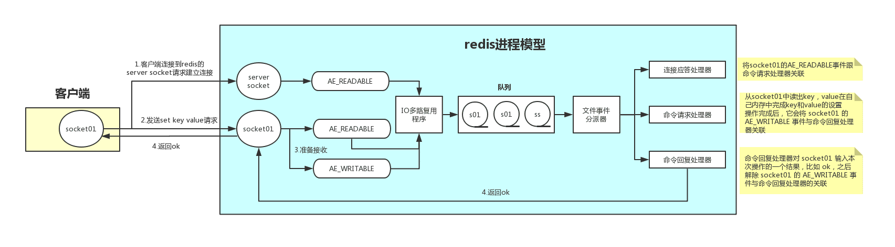

# Redis

# 数据类型及适用场景

Redis 主要有一下集中数据类型：

- String
- Hash
- List
- Set
- Sorted Set

> Redis 除了这 5 种数据类型之外，还有 Bitmaps、HyperLogLogs、Streams 等。

## String 字符串

**存储类型**

这是最简单的类型，存储字符串、整数、浮点数。

**操作命令**

```bash
set key value [EX seconds] [PX milliseconds] [NX|XX]
get key
```

**使用场景**

- 热点数据、静态低改动数据的缓存
- 分布式锁服务
- 分布式 session
- 全局 id 使用的时候取一个批次的数据（INCR 方法）
- 限流，设置一个带有过期时间的key，value存限流次数，通过在过期时间内判断value来实现 

## Hash 哈希

**存储类型**

包含键值对的无序散列表。一个 key 下有多个键值对

**操作命令**

```bash
hset website baidu www.baidu.com
hget website taobao www.taobao.com
hexists website baidu
```

**使用场景**

- 类似购物车的多个商品信息

## List

**存储类型**

存储有序的字符串，元素可以重复。可以充电队列和栈的角色。

**操作命令**

```bash
lpush key a 
rpush key b
lpop key
rpop key
lindex key 0	# 获取第0位的value
lrange key 0 -1 # 获取范围内所有内容
```

**使用场景**

- 因为是有序的，可以用来做类似朋友圈的时间线
- 队列（先进先出）
- 栈（先进后出）

## Set

**存储类型**

string 类型无序集合

**操作命令**

```bash
# 单个 set 的操作
sadd key a b c d e # 添加元素
smembers key # 获取所有元素
scard key # 统计元素个数
srandmember key # 随机获取一个元素
spop key # 随机弹出一个元素
srem key a # 移除元素
sismember key a # 查看元素是否存在

# 多个 set 操作
# 获取差集
sdiff set1 set2
# 获取交集
sinter set1 set2
# 获取并集
sunion set1 set2
```

**使用场景**

- 抽奖（随机弹出一个抽奖用户）
- 点赞（朋友圈id 作为key， 维护所有点赞用户；sadd点赞；srem取消点赞；smembers点赞用户；scard 点赞数）
- 打卡（类似点赞）
- 商品标签、筛选（将标签作为key，商品作为value，通过求多个set并集返回商品筛选信息）
- 用户关注、推荐模型

## Sorted Set （zset）

**存储类型**

有序的set集合，每个元素有个 scope

scope 相同时，按照key的ascii码排序

**操作命令**

```bash
zadd key 10 java 20 js 30 php 40 c # 添加元素
zincrby key 15 java
zrange key 0 -1 withscores # 获取全部元素
zrangebyscore key 20 30 # 获取指定score返回的元素
zrevrange key 0 10 withscores # 倒序获取0-10个元素
zrem key php # 删除元素
zcard key # 统计元素个数
zcount key 20 40 # 统计分值内的个数
zrank key java # 获取元素的rank
zscore key java # 获取元素的score
```

**使用场景**

- 热点新闻排行榜（zincrby：增加点击量，zrevrange 获取点击最多的新闻）

## bitmap

字符串上的位操作。统计用于在线情况，活跃用户等。

## Hyperloglos

提供了一种不太准确的基数统计方法，比如统计网站的UV、PV，存在一定误差。

## Sreams

支持多播的可持久化消息队列，用于实现发布订阅功能。


# 原理解析

## 事务

比如在业务过程中需要对 redis 进行多次操作命令，并且确保多个命令的原子性，就需要事务机制。

例如，使用 redis 作为分布式锁的时候，先要 setnx 设置可以，业务处理完需要 del 释放锁，这两个动作需要公共成功。

redis 的事务涉及到四个命令：multi (启动)、exec(执行)、discard(取消)、watch(监视)

## 运行机制

redis 运行为什么这么快？可以达到秒级10w并发量。

- 纯内存结构（KV结构内存数据库，时间复杂度简单）
- 单线程（减少线程创建销毁的损耗，避免上下文切，避免了线程之间带来的竞争问题）
- 多路复用的异步非阻塞IO模型，处理并发连接


**工作模型图**



## 内存回收机制

redis 所有数据都是存储在内存中的，在某些情况下需要对占用的内存空间进行回收。内存回收主要是两类，一是对过期 key的回收，一类是内存使用达到上限触发淘汰机制。

### 过期策略

redis 的过期策略是：**定期删除 + 惰性删除**。

**定期删除**，指的是 redis 默认每隔 100ms 就随机抽取一些设置了过期时间的 key，检查是否过期，过期则删除。

**惰性删除**，指的是在获取某个 key 的时候，redis 会检查这个 key 是否过期，过期则删除，不返回任何东西。

但实际上这还是有问题，如果定期删除遗漏到很多过期的 key，我们也没有及时去查，导致大量过期 key 堆积在内存里，咋办。

这时候会走**内存淘汰机制**。

### 淘汰策略

redis 内存淘汰机制有以下几个：

- noeviction:当内存不足时，新写入操作会报错。
- **allkeys-lru:当内存不足时，移除最少使用的 key （最常用）**
- allkeys-random:当内存不足时，随机移除某个 key
- allkeys-lfu:当内存不足时，选择最不常用的 key
- volatile-lru:当内存不足时，移除最少使用的过期 key
- volatile-random:当内存不足时，随机移除过期 key
- volatile-lfu:当内存不足时，选择最不常用的过期 key
- volatile-ttl:当内存不足时，更早过期的key优先移除

## 持久化

redis 运行速度快是因为它的所有数据都存储在内存中。但是如果断电、宕机等情况会导致数据丢失，所以需要进行持久化操作。

redis 持久化的两种方式

- RDB (Redis Database)
- AOF (Append Only File)

### RDB

RDB 是 redis 默认的持久化方案。当满足一定条件的时候，会把当前内存中的数据写入到磁盘。

可以配置触发规则 `save 900 1` 自动触发或者通过 `save` 手动触发。

优点：

- RDB 是一个非常紧凑的文件，它保存了 redis 在某个时间点上的数据。这种文件非常适合备份和灾备恢复。
- 生成 RDB 文件的时候，redis 主进程会 fork 一个子进程来处理，不影响住进程操作。
- RDB 在恢复大数据集的时候比 AOF 快。

缺点：

- RDB 没办法做到实时持久化。因为 bgsave 每次运行都要执行 fork 操作创建子进程，频繁执行成功过高。
- 在一定间隔时间内做一次备份，如果突然宕机，会丢失数据。

### AOF

AOF 采用日志的形式来记录每个写操作，并追加到文件中。开启后，执行更改 redis 数据的命令时，就会把命令写入到 AOF 文件中。redis 重启时，会根据日志文件的内容把写指令从前到后执行一次已完成数据的恢复工作。

```properties
# redis.conf
appendonly yes
appendfilename "appendonly.aof"
# 持久化策略
appendfsync everysec/no/always
#  重写触发机制
auto-aof-rewrite-percentage 100 
auto-aof-rewrite-min-size 64mb
# 重写时写入数据处理机制
no-appendfsync-on-rewrite yes
aof-load-truncated yes
```

优点：

- AOF 持久化的方法提供多种不同频率，丢失数据可控。

缺点：

- 生成的 AOF 文件比 RDB 的体积更大。
- AOF 性能比 RDB 的略差。

### RDB 与 AOF 如何选择

- 不要仅仅选择 RDB，因为那样会导致丢失很多数据；
- 也不要仅选择 AOF，因为AOF做冷备数据恢复慢，而且RDB可以避免AOF备份恢复出现的bug
- redis 支持同时使用RDB、AOF，我们可以综合使用，AOF来保证数据不丢失，作为数据恢复的第一选择；RDB 来做不同程度的冷备，在AOF丢失或损坏时，用RDB来快速恢复数据。 

# 集群

## 主从复制（replication）

新版本的 master-slave 改名成 replication。

**原理：**

1. slave 节点启动的时候，会保存 master 节点相关信息。并与 master 节点建立 socket 通信。
2. slave 通过 socket 通信同步 master 数据。（新数据会放到缓冲区）

**不足：**

1. RDB 文件过大，同步非常耗时
2. 在主从模式下，主节点宕机，对外服务就不可用，单点问题没有解决，需要人工切换主节点。

## 哨兵模式（sentinel）

在主从复制模式下，需要人工去切换主节点。那么能否实现自动切换呢？思路大致如下：

创建一台监控服务器来监控所有的 redis 服务节点的状态，通过心跳机制，判断 master 是否下线(宕机)，然后把一台 slave 节点变成 master 节点。

那监控服务器宕机怎么办？部署监控服务集群。

这里涉及到两个主要点：

- 如何判断 master 下线
- master 下线之后选举机制

**服务下线**

sentinel 默认 每秒一次发送心跳监听，在 `down-after-milliseconds` 内没返回，sentinel 会将 master 标记为下线（主观下线）。这个时候 sentinel 会想其他 sentinel 节点发送确认机制，如果半数以上返回 ACK 信息，master 才真正被确认下线（客观下线），然后就需要进行选举 master 节点。

**master 选举**

sentinel 集群开始进行 leader 选举，由 leader 完成故障转移（做 master 服务，并同步数据）。sentinel 通过 Raft 算法，实现 leader 选举。

[Raft 算法演示](http://thesecretlivesofdata.com/raft/)

**不足**

1. 主从切换的过程中会丢失数据，因为只有一个 master 节点
2. 只能单点写数据，没有解决水平扩容问题
3. 多个 master-slave 的 group，数据如何分片？分片之后的路由如何实现？
4. 要搭建 sentinel 集群，防止脑裂情况

## redis 集群数据分片方案

如果要实现 redis 数据分片，大概有三种方案。

- 客户端实现相关逻辑，在执行命令的时候判断 key 的路由。（取模或者一致性hash算法）
- 把分片处理的逻辑抽取出来，运行一个独立的代理服务，客户端连接到这个代理服务并请求转发。
- 基于服务端实现

### 客户端实现（Sharding）

jedis 客户端提供了 redis sharding 的方案，并支持连接池。

优缺点：

- 使用 ShardedJedis 客户端分片代码优势是配置简单，不依赖其他中间件，自定义分片逻辑，比较灵活。
- 劣势就是不能动态的服务增减，每个客户端需要自行维护分片策略。

案例：

```java
public class ShardingTest {
    public static void main(String[] args) throws Exception{
        JedisPoolConfig config = new JedisPoolConfig();
        JedisShardInfo info1 = new JedisShardInfo("192.168.1.100", 6379);
        JedisShardInfo info2 = new JedisShardInfo("192.168.1.200", 6379);
		List<JedisShardInfo> list = Arrays.asList(info1, info2);
        ShardJedisPool pool = new ShardJedisPool(config, list);
        ShardedJedis jedis =  jedisPool.getResource();
        // 根据key来实现分片算法
        for(int i=0; i<100; i++){
       		jedis.set("k"+i, ""+i); 
        }
        for(int i=0; i<100; i++){ 
            System.out.println(jedis.get("k"+i));
        }
    }
}
```


### 代理实现 Proxy

典型的代理是有 Twemproxy 和 codis

**Twenproxy**

优缺点：

- 比较稳定，可用性高
- 出现故障不能自动转移，架构复杂，需要借助其他组件（LVS/HAProxy + Keepaliced）实现高可用
- 扩容需要修改配置，不能平滑地扩缩容

原理图：


**codis**

分片原理： codis 把所有的 可以 分成了 n 个槽，每个槽对应一个分组，一个分组对应一个或者一组 redis 实例。

codis的槽位映射关系是保存在 proxy 中的，如果要解决单点问题，就需要集群部署，通过 zk 来同步槽与实例的关系。（太麻烦了，redis 服务没用起来，其他高可用集群先部署不少，codis、zk集群等）


## cluster

redis cluster 是 3.0 版本推出的，用来解决分布式的需求，同时也可以实现高可用。跟 codis 不一样，它是去中心化的，客户端可以拦截任意一个可用节点。

**节点通信原理**


**数据分片**

redis cluster 通过 hash clot 算法来实现。

Redis cluster 有固定的 `16384` 个 hash slot，对每个 `key` 计算 `CRC16` 值，然后对 `16384` 取模，可以获取 key 对应的 hash slot。

Redis cluster 中每个 master 都会持有部分 slot，比如有 3 个 master，那么可能每个 master 持有 5000 多个 hash slot。hash slot 让 node 的增加和移除很简单，增加一个 master，就将其他 master 的 hash slot 移动部分过去，减少一个 master，就将它的 hash slot 移动到其他 master 上去。移动 hash slot 的成本是非常低的。客户端的 api，可以对指定的数据，让他们走同一个 hash slot，通过 `hash tag` 来实现。


**高可用和主备切换**

Redis cluster 的高可用的原理，几乎跟哨兵是类似的。

在心跳机制内，slave 认为 master 宕机(主观宕机)，如果多个节点都认为 master 宕机(客观宕机)，会进行 leader 选举。


# 实战

## 缓存、数据库一致性问题

在使用 redis 作为缓存，程序使用的时候会先读取缓存，不存在的情况下才会去查询数据库。

先删除缓存，在进行数据操作；或者 先操作数据库在删除缓存的方案都会有一定的问题。

可以操作**延时双删**的方案，先删除缓存，在操作数据库，然后在删除一次缓存。


## 缓存雪崩、缓存穿透、缓存击穿

### 缓存雪崩

系统使用高峰期，由于 redis 意外全盘宕机(热点key 大量同时过期)，大量请求直接打到数据库，数据库奔溃，重启数据库，又被新的流量打死，这就是缓存雪崩。

解决方案

- 搭建 redis 高可用集群
- sentinel、hystrix 实现服务限流、降级，避免数据库奔溃
- 通过随机数，是 key 在不同的时间过期
- 通过分布式锁，针对同一个 key 只允许一个线程到数据库查询
- 缓存预先更新，避免同时失效

### 缓存穿透

恶意大量模拟请求，查询数据库不存在数据（因为数据库不存在，redis 也没有缓存数据），直接略过 redis，大量请求入到数据库，导致数据库奔溃，这种恶意攻击场景就是缓存穿透。

举个例子，假如表是用主键 id 从 1 自增，但是黑客发过来的请求都是负数。这样的话，缓存不会命中，直接查询数据库。

- 做程序入参校验
- 使用布隆过滤器（先把表数据导入布隆过滤器中，然后过来的请求先去布隆过滤器中查询，如果不存在，则可以认为是无效请求）

### 缓存击穿

某个热点 key，访问非常频繁，当这个 key 突然过期失效了，导致缓存失效，请求直接打入数据库，就像在一道屏障上被打穿了一个洞。

解决方法

- 若数据基本不会发生更新，那么热点 key 可以设置成永不过期
- 若数据更新不频繁且更新时间短，那可以基于redis、zk实现分布式锁，来更新数据。
- 若数据更新频繁或更新时间长，可以缓存定时预先更新，避免失效。