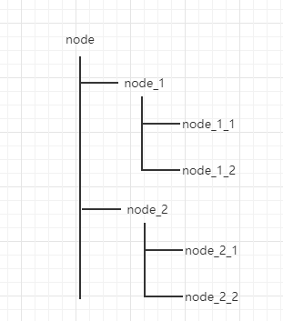

# zookeeper 安装部署

先安装jdk环境

## 单机模式

1. 下载zookeeper 安装包
2. tar -zxvf 解压
3. 切换到`conf`目录下，`cp zoo_simple.cfg zoo.cfg`
4. 常用命令
   - 启动zk服务： `sh zkServer.sh start`
   - 查看zk状态：`sh zkServer.sh status`
   - 停止zk服务：`sh zkServer.sh stop`
   - 重启zk服务：`sh zkServer.sh restart`
   - 连接服务器：`sh zkCli.sh -timeout 0 -r -server ip:port`


## 集群模式

1. 复制一份zoo.cfg，修改配置文件

   ```shell
   server.1=IP1:2888:3888 
   server.2=IP2:2888:3888
   server.3=IP3:2888:3888
   # server.A=B:C:D
   # A:服务器id
   # B:服务器ip
   # C:数据交换端口
   # D:选举端口
   ```

   

2. 安装目录下新建`dataDir`目录，在该目录下新增myid文件，内容对应上述配置服务器id

3. 关闭防火墙，或者防火墙打开对应端口

4. 启动zookeeper


# zookeeper 基础

## zookeeper 数据模型

zookeeper 的视图结构和标准的文件系统非常类似，每一个节点称之为 ZNode，是 zookeeper 的最小单元。每个 znode上都可以保存数据以及挂载子节点。构成一个层次化的树形结构。



## zookeeper 节点特性

- 持久节点(PERSISTENT)：存储在文件中
- 持久有序节点(PERSISTENT_SEQUENTIAL)：为下一级节点维护一个持久顺序节点
- 临时节点(EPHEMERAL)：session回话结束节点删除
- 临时有序节点(EPHEMERAL_SEQUENTIAL)：为下一级节点维护一个临时顺序节点
- 容器节点(CONTAINER)：子节点为空，容器节点删除
- 过期节点(TTL)：过期时间后节点自动删除


## Stat 节点状态

一个节点除了存储数据内容以外，还存储了数据节点本身的一些状态信息，通过`get`命令可以获得状态信息的详细内容。版本有点和我们经常使用的乐观锁类似。

|    状态特性    | 说明                                                 |
| :------------: | ---------------------------------------------------- |
|     czxid      | 即 Create ZXID，表示该节点被创建时的事务id           |
|     mzxid      | 即 Modified ZXID，表示该节点最后一次被更新时的事务id |
|     ctime      | 创建的时间                                           |
|     mtime      | 最后一次被更新的时间                                 |
|    version     | 数据节点的版本号                                     |
|    cversion    | 子节点的版本号                                       |
|    aversion    | 节点的ACL版本号                                      |
| ephemeralOwner | 临时节点的sessionId                                  |
|   dataLength   | 数据长度                                             |
|  numChildren   | 当前节点的子节点个数                                 |
|     pzxid      | 表示该节点的子节点列表最后一次被修改的事务Id         |


## 节点事件监听

Watcher 监听机制是 Zookeeper 中非常重要的特性，我们基于 zookeeper 上创建的节点，可以对这些节点绑定监听事件，比如可以监听节点数据变更、节点删除、子节点状态变更等事件，通过这个事件机制，可以基于 zookeeper 实现分布式锁、集群管理等功能。


| zookeeper事件                 | 事件含义                                                   |
| ----------------------------- | ---------------------------------------------------------- |
| EventType.NodeCreated         | 当 node-x 这个节点被创建时触发                             |
| EventType.NodeChildrenChanged | 当 node-x 这个节点的直接子节点被创建、被删除、被修改时触发 |
| EventType.NodeDataChanged     | 当 node-x 这个节点的数据发生变更时触发                     |
| EventType.NodeDeleted         | 当 node-x 这个节点被删除时被触发                           |
| EventType.None                | 当 客户端的连接状态发生变更时触发                          |


# zookeeper 设计目标

Apache ZooKeeper 是一个高可靠的分布式协调中间件。前生是Google Chubby，主要是为了解决分布式一致性问题的组件，同时也是一个粗粒度的分布式锁服务。

## 分布式一致性问题

​		在一个分布式系统中，有多个节点，每个节点都会提出一个请求，但是在所有节点中只能确定一个请求被通过。而这个通过是需要所有节点达成一致的结果，所以所谓的一致性就是在提出的所有请求中能够选出最终一个确定请求，并且这个请求选出来以后，所有节点都需要知道。

​		所以：分布式一致性的本质，就是在分布式系统中，多个节点就某一个提议如何达成一致。

​		zookeeper 通过leader-follower 主从机制来确定主节点，在通过主节点来同步各个子节点的一致性。

## 分布式锁服务

​		从另一个层面，zookeeper 提供了创建节点表示加锁操作。创建成功表示抢占到锁。


# zookeeper 设计猜想

基于zookeeper 本身的一个设计目标，zookeeper 主要是解决分布式环境下的服务协调问题而产生的，需要满足一下功能：

## 防止单点故障

​		首先，在分布式架构中，任何的节点都不能以单点的方式存在，常见的解决单点问题的方式就是集群。那这个集群需要满足如下功能：

1. 要有主从节点
2. 要能数据同步，主节点出现问题从节点顶替主节点工作的前提是数据一致
3. 主节点故障后，从节点如何顶替工作

## leader 角色

leader 服务器是整个服务集群的核心，主要的工作

1. 事务请求的唯一调度和处理者，保证集群事务处理的顺序性
2. 集群内部各服务器的调度者

## follower 角色

follower  角色的主要职责是

1. 处理客户端非事务请求、转发事务请求给 leader 服务器
2. 参与事务请求的投票（需要半数以上服务器通过才能通知Leader服务器进行commit）
3. 参与leader 选举的投票

## observer角色

作为优化角色，主要的职责是

1. 同步leader数据
2. 接受非事务请求
3. 不参与事务请求投票、leader选举投票


## 数据同步

​		leader 节点如何和其他节点保证数据一致性，并且要求是强一致的。在分布式系统中，每一个机器节点虽然都能够明确知道自己进行的事务操作过程是成功和失败，但是却无法直接获取其他分布式节点的操作结果。所以当一个事务操作涉及到跨节点的时候，就需要用到分布式事务，分布式事务的数据一致性协议有 2PC 协议、 3PC 协议、Raft 协议


# zookeeper 原理分析

## zookeeper 数据同步流程

​		在zookeeper 设计中，可以知道zookeeper是由三种集群角色来组成整个高性能的。客户端会随机连接到zookeeper集群中的一个节点，如果是读请求，就直接从当前节点中读取数据，如果是写请求，那么请求会被转发给leader提交事务，然后leader会广播事务，只要有超过半数节点写入成功，那么些请求就会被提交（类似2PC事务）。

从上面可以发现几个问题：

1. 集群中的leader是如何选举出来的？
2. leader 节点奔溃后，整个集群无法处理写请求，如何快速从其他节点里面选举出新的leader呢？
3. leader 节点和各个follower 节点的数据一致性如何保证的


### ZAB协议

​		ZAB（zookeeper atomic broadcast）协议是为分布式协调服务 zookeeper 专门设计的一种支持奔溃恢复的原子广播协议。在zookeeper 中，主要依赖ZAB协议来实现分布式数据一致性，基于该协议，zookeeper实现了一种主备模式的系统架构来保持集群中各个副本之间的数据一致性。


#### zab 协议介绍

zab 协议包含两种基本模式，分别是

1. 奔溃恢复
2. 原子广播


​		当整个集群在启动时，或者当leader节点出现网络中断、奔溃等情况，ZAB协议就会进入恢复模式并选举产生新的leader，当leader选举出来之后，并且集群中有过半的机器和该leader节点完成数据同步后，ZAB协议机会退出恢复模式。

​		当集群中有过半的follower节点完成了和leader状态同步之后，那么整个集群就进入了消息广播模式。这个时候，在leader 节点正常工作时，启动一台新的服务器加入到集群，那这个服务器会直接进入数据恢复模式，和leader节点进行数据同步。同步完成后即可正常对外提供非事务请求的处理。


#### 消息广播的实现原理

消息广播的过程实际上是一个简化版本的二阶段提交过程。

1. leader接收到消息请求后，将消息赋予一个全局唯一的64位自增id（zxid），通过zxid的大小比较可以实现有序性
2. leader为每个follower准备了一个FIFO队列（通过TCP协议来实现，以实现全局有序这一个特点）将带有zxid的消息作为一个提案分发给所有follower
3. 当follower接受到提案，先把提案写到磁盘，写入成功后向leader回复一个ack
4. 当leader接受到合法数量的ack后，leader就会向这些follower发生commit命令，同时会在本地执行该消息
5. 当follower收到消息的commit 命令以后，会提交该消息


#### 奔溃恢复的实现原理

​		leader 因为各种问题失去了过半的follower节点的联系，那么就会进入到奔溃恢复模式，在奔溃恢复状态下，zab协议需要做两件事情：

1. 选举出新的leader
2. 数据同步

​		因为ZAB协议是一个简化的2PC协议，这种协议只需要集群中过半的节点响应提交即可。但是它无法处理leader服务器奔溃带来的数据不一致问题。

​		那么ZAB协议中的奔溃恢复需要保证，如果一个事务在一台机器上成功处理，那么这个事务应该在所有机器上处理成功。为了达到这个目的，zookeeper中会有哪些场景导致数据不一致性，以及针对这个场景，zab协议中的奔溃恢复应该怎么处理。

1. 已经被处理的消息不能丢：leader发送一个事务请求A，follower节点接收到请求，并返回ack，当leader发送commit命令前，leader奔溃这种情况下，ZAB协议需要事务A最终能在所有机器上成功提交
2. 被丢弃的消息不能再次出现：当leader接受到一个事务请求A之后，leader未转发给follower节点就奔溃，经过重新选举leader之后，事务A是被跳过的。原来的leader重启后变成了follower节点，它保留的事务A的状态跟集群的状态是不一致，需要删除。


​		ZAB 协议需要满足上面两种情况，就必须要设计一个leader选举算法：能够确保已经被leader提交的事务能够提交、同时丢弃已经被跳过的事务。

针对这个要求：

1. 如果leader选举算法能够保证新选举出来的leader服务器拥有集群中所有机器最高的编号（zxid）最大的事务请求，那么就可以保证这个新选举出来的leader一定具有已经提交的提案。
2. zxid 是有32位的epoch + 32位的消息计数器组成。这样设计的好处在于老的leader挂了以后重启，它不会被选举为leader。因此它的zxid肯定小于当前新的leader。当老的leader作为follower接入新的leader集群后，新的leader会让它将所有拥有旧的epoch号的未被commit的事务清除。


## leader选举原理


leader 选举存在两个阶段：

1. 启动时候的leader选举
2. 运行过程中，leader奔溃之后的选举


首先要知道选举过程设计到几个重要参数

- myid: 服务器对应的id，编号越大在算法中权重越大

- zxid: 事务id，值越大说明数据越新
- epoch: 投票次数，每一次投票会自增

选举状态

- LOOKING：竞选状态
- FOLLOWING：随从状态，同步leader状态，参与投票
- OBSERVING：观察状态，同步leader状态，不参与投票
- LEADING：领导者状态


### 服务器启动时的leader选举 

​		若进行lead选举，至少需要两台机器，假设有3台机器组成的集群。在server1启动时，其单独无法完成leader选举，当server2启动时，此时server1和server2可以互相通信，每台机器都试图找到leader，于是进入leader选举过程。选举过程如下：

1. 每个server发出一个投票。由于是初始状态，server1和server2都会将自己作为leader来进行投票，每次投票会包含锁推举的服务器的(myid,zxid,epoch)，此时server1的投票为(1,0,0)，server2的投票为(2,0,0)，然后各自将这个投票发给集群中的其它机器。
2. 接受来自各个服务器的投票。集群的每个服务器收到投票后，首先判断该投票的有效性，如检查是否本轮投票（epoch），是否来自LOOKING状态的服务器
3. 处理投票。针对每一个投票，服务器都需要将别人的投票和自己的投票进行PK，PK规则如下
   1. 优先比较epoch
   2. 再比较zxid，zxid最大的服务器有限作为leader
   3. 如果zxid相同，那就比较myid，myid最大的服务器作为leader
4. 统计投票。每次投票后，服务器都会统计投票信息，判断是否已经有过半机器接受相同的投票信息，对于server1、server2来说，都统计出集群中已经有两台机器接受了(2,0,0)的投票信息，此时便认为已经选出了leader
5. 改变服务器状态，一旦确定了leader，每个服务器就会更新自己的状态。

### 运行过程中的leader选举

​		当集群中的leader出现奔溃时，那么整个集群无法对外提供服务，而是进入新一轮的leader选举，服务器运行期间的leader选举和启动时期的leader选举基本过程是一致的。

1. 变更状态。leader奔溃后，余下的follower服务器都会讲自己的服务器状态变更为LOOKING。然后进入leader选举
2. 每个server会发出一个投票，在运行期间，每个服务器上的zxid可能不同，此时假定server1的zxid=123，server的zxid为122，在每一轮投票中，server1和server3都会投资及，产生投票(1,123,3)、(1,122,3)，然后各自将投票发送给集群中的所有机器。
3. 接受各自服务器的投票、处理投票、统计投票、改变服务器状态。（后续流程与启动选举相同）

