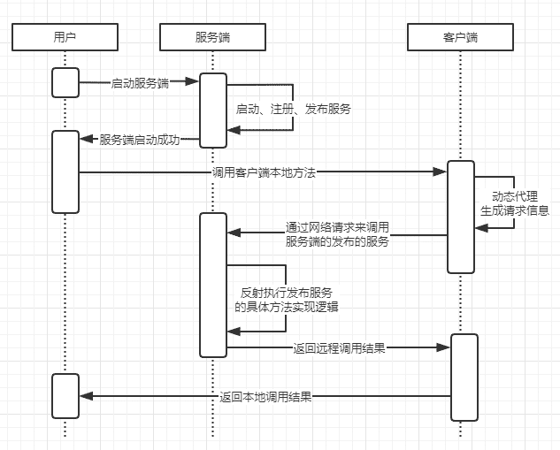

# rpc

## 基本概念

RPC（Remote Procedure Call）远程过程调用，简单的理解是一个节点请求另一个节点提供的服务。

RPC就是要实现像 **本地过程调用** 的方式一样去调用远程方法。

因为 **远程函数调用** 是调用服务端的方法，所以会涉及到个要点

- 执行对应服务端的哪个方法（call id 的映射）
- 网络传输（网络传输协议）
- 序列化、反序列化（网络传输是通过字节码传输、各个语言的不同）

## 简单的逻辑时序图

## demo

[github地址](https://github.com/ShenGuangYang/rpc)

**rpc-server-provider** 包下spring是集成到spring的实现

