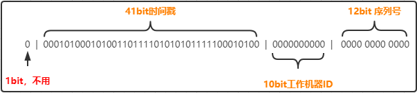
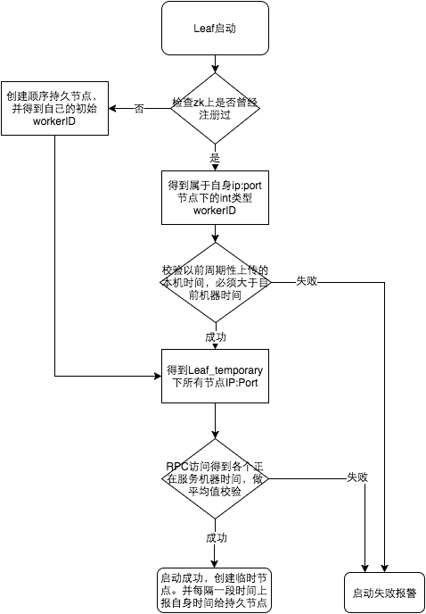

# 全局唯一id


## 数据库方案
通过建立一张表，每次取生成id的时候自动递增。
伪代码
```sql
CREATE TABLE "seq" (
  "id" int(11) NOT NULL AUTO_INCREMENT,
  "bid" int(11) DEFAULT NULL,
  PRIMARY KEY ("id"),
  UNIQUE KEY "uk_bid" ("bid") USING HASH
)
```
```sql
begin;
 REPLACE into seq( bid) values(1);
 select LAST_INSERT_ID();
commit;
```
优点：
- 实现简单，维护成本小
缺点：
- DB 读写性能限制
- DB 异常时，发号不可用。
- 通过 step 搭建多主服务，扩容困难。


## redis、mongdb
redis 通过incr()、 incrBy() 命令保证原子递增来保证唯一性。
mongdb 通过 Objectid 保证唯一性。

## 雪花算法

雪花算法的构成是使用一个 64位的long 型数字作为全局唯一id。



因为是根据时间来生成id，有可能会出现时间回拨的情况，导致出现重复id。

## leaf 算法

### leaf segment
是针对上述数据库方案的优化，改动如下：
- 原方案是每次获取ID都会去读写数据库，造成数据库读写压力大。现改为批量获取，每次获得一个 segment 号段的值。使用完之后再去获取新的号段，可以大大减小数据库的压力。
- 每个业务不同的发号需求用 biz_tag 字段来区分，每个 biz_tag 的id 相互隔离，互不影响。有扩容需要可以针对biz_tag 做分库分表。
优点：
- Leaf服务可以很方便的线性扩展，性能完全能够支撑大多数业务场景。
- ID号码是趋势递增的8byte的64位数字，满足上述数据库存储的主键要求。
- 容灾性高：Leaf服务内部有号段缓存，即使DB宕机，短时间内Leaf仍能正常对外提供服务。
- 可以自定义max_id的大小，非常方便业务从原有的ID方式上迁移过来。

缺点：
- ID号码不够随机，能够泄露发号数量的信息，不太安全。
- TP999数据波动大，当号段使用完之后去DB获取号段可能会因为网络问题等导致获取号段失败。
- DB宕机会造成整个系统不可用。

#### 双buffer优化
对于第二个缺点，Leaf-segment做了一些优化，简单的说就是：

采用双buffer的方式，Leaf服务内部有两个号段缓存区segment。当前号段已下发10%时，如果下一个号段未更新，则另启一个更新线程去更新下一个号段。当前号段全部下发完后，如果下个号段准备好了则切换到下个号段为当前segment接着下发，循环往复。

### Leaf-snowflake

Leaf-segment方案可以生成趋势递增的ID，同时ID号是可计算的，不适用于订单ID生成场景，比如竞对在两天中午12点分别下单，通过订单id号相减就能大致计算出公司一天的订单量，这个是不能忍受的。面对这一问题，我们提供了 Leaf-snowflake方案。

Leaf-snowflake方案完全沿用snowflake方案的bit位设计，即是“1+41+10+12”的方式组装ID号。对于workerID的分配，当服务集群数量较小的情况下，完全可以手动配置。Leaf服务规模较大，动手配置成本太高。所以使用Zookeeper持久顺序节点的特性自动对snowflake节点配置wokerID。Leaf-snowflake是按照下面几个步骤启动的：
1. 启动Leaf-snowflake服务，连接Zookeeper，在leaf_forever父节点下检查自己是否已经注册过（是否有该顺序子节点）。
2. 如果有注册过直接取回自己的workerID（zk顺序节点生成的int类型ID号），启动服务。
3. 如果没有注册过，就在该父节点下面创建一个持久顺序节点，创建成功后取回顺序号当做自己的workerID号，启动服务。

#### 解决时钟问题
因为这种方案依赖时间，如果机器的时钟发生了回拨，那么就会有可能生成重复的ID号，需要解决时钟回退的问题。



参见上图整个启动流程图，服务启动时首先检查自己是否写过ZooKeeper leaf_forever节点：
1. 若写过，则用自身系统时间与leaf_forever/${self}节点记录时间做比较，若小于leaf_forever/${self}时间则认为机器时间发生了大步长回拨，服务启动失败并报警。
2. 若未写过，证明是新服务节点，直接创建持久节点leaf_forever/${self}并写入自身系统时间，接下来综合对比其余Leaf节点的系统时间来判断自身系统时间是否准确，具体做法是取leaf_temporary下的所有临时节点(所有运行中的Leaf-snowflake节点)的服务IP：Port，然后通过RPC请求得到所有节点的系统时间，计算sum(time)/nodeSize。
3. 若abs( 系统时间-sum(time)/nodeSize ) < 阈值，认为当前系统时间准确，正常启动服务，同时写临时节点leaf_temporary/${self} 维持租约。
4. 否则认为本机系统时间发生大步长偏移，启动失败并报警。
5. 每隔一段时间(3s)上报自身系统时间写入leaf_forever/${self}。

由于强依赖时钟，对时间的要求比较敏感，在机器工作时NTP同步也会造成秒级别的回退，建议可以直接关闭NTP同步。要么在时钟回拨的时候直接不提供服务直接返回ERROR_CODE，等时钟追上即可。或者做一层重试，然后上报报警系统，更或者是发现有时钟回拨之后自动摘除本身节点并报警。