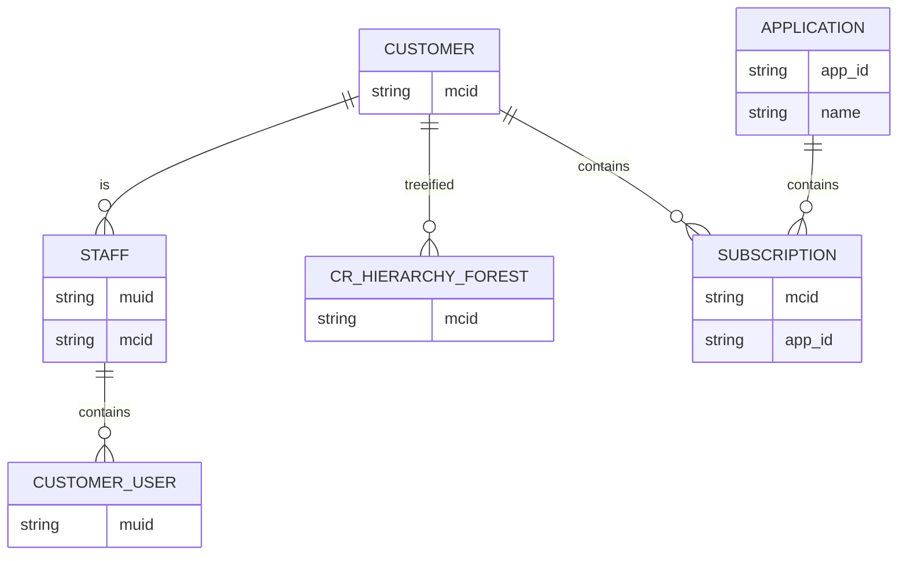

# 索引

```mermaid

erDiagram
    
    CUSTOMER ||--o{ STAFF : is
    CUSTOMER ||--o{ CR_HIERARCHY_FOREST : treeified
    CUSTOMER ||--o{ SUBSCRIPTION : contains
    STAFF ||--o{ CUSTOMER_USER : contains
    APPLICATION ||--o{ SUBSCRIPTION : contains

    
    CUSTOMER {
        string mcid
    }
    CUSTOMER_USER {
        string muid
    }
    STAFF {
        string muid
        string mcid
    }
    CR_HIERARCHY_FOREST {
        string mcid
    }
    SUBSCRIPTION {
        string mcid
        string app_id
    }
    APPLICATION {
        string app_id
        string name
    }
```