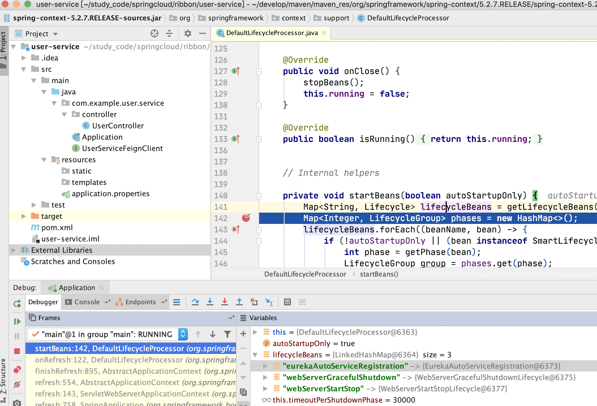

# eureka

针对于  [spring cloud openfeign](springcloud/openfeign.md) 中的使用示例，完成了面向接口的远程通信功能，但是还有一个问题，我们的服务地址信息是写入到配置文件中，正式环境中，这些服务肯定是动态的，基于 openfeign 我们是实现不了服务的动态感知的。所以引入了 eureka 组件实现注册中心的功能。

# 使用实例

**启动一个 eureka 服务**

新增spring boot 项目，在启动类上添加 @EnableEurekaServer 注解

pom.xml

```xml
<dependency>
    <groupId>org.springframework.cloud</groupId>
    <artifactId>spring-cloud-starter-netflix-eureka-server</artifactId>
</dependency>
```

application.yml

```yaml
server:
  port: 9090
eureka:
  instance:
    hostname: localhost   #eureka 服务端实例名称
  client:
    register-with-eureka: false   #false 表示不向注册中心中注册自己
    fetch-registry: false   #false 表示自己端就是注册中心,我的职责就是维护服务实例，并不需要去检索服务
    service-url:
      defaultZone: http://${eureka.instance.hostname}:${server.port}/eureka/   #设置与 Eureka Server 交互的地址查询服务和注册服务都需要依赖这个地址(服务暴露的地址)
```


**其他服务与注册中心交互**

引入 jar

```xml
 <dependency>
     <groupId>org.springframework.cloud</groupId>
     <artifactId>spring-cloud-starter-netflix-eureka-client</artifactId>
</dependency>
```

application.yml

```properties
server:
  port: 8080
eureka:
  client:
    service-url:
      defaultZone: http://${eureka.instance.hostname}:${server.port}/eureka/   #设置与 Eureka Server 交互的地址查询服务和注册服务都需要依赖这个地址(服务暴露的地址)
```

# 服务注册源码分析

要找到 Eureka 的服务注册入口，首先要知道 Spring 中的 SmartLifecycle 接口，当 Spring 容器加载完所有的 Bean 并且初始化之后，会继续回调实现了 SmartLifecycle 接口对应的方法（start方法）。

Spring boot 执行 SmartLifecycle 的调用链路如下：

```java
SpringApplication.run() -> 
    this.refreshContext(context); -> 
    this.refresh(context); -> 
    ServletWebServerApplicationContext.refresh(); ->
    this.finishRefresh(); ->
    AbstractApplicationContext.finishRefresh() ->
    DefaultLifecycleProcessor.onRefresh() -> 
    this.startBeans(); ->
    this.start(); ->
    this.doStart()->
    SmartLifecycle.start()
```


找到 DefaultLifecycleProcessor.start() 方法，在 `Map<String, Lifecycle> lifecycleBeans = getLifecycleBeans();` 这一行加上 Debug，然后启动 Spring boot 项目，可以看到 lifecycleBeans 里面已经包含了 eurekaAutoServiceRegistration，从而我们知道 eureka 的服务注册肯定是在 `EurekaAutoServiceRegistration.start()` 方法内执行的。



## EurekaAutoServiceRegistration.start()

```java
public void start() {
    // only set the port if the nonSecurePort or securePort is 0 and this.port != 0
    // 安全端口处理
    if (this.port.get() != 0) {
        if (this.registration.getNonSecurePort() == 0) {
            this.registration.setNonSecurePort(this.port.get());
        }

        if (this.registration.getSecurePort() == 0 && this.registration.isSecure()) {
            this.registration.setSecurePort(this.port.get());
        }
    }

    // only initialize if nonSecurePort is greater than 0 and it isn't already running
    // because of containerPortInitializer below
    if (!this.running.get() && this.registration.getNonSecurePort() > 0) {
		// 注册服务
        // this.serviceRegistry = EurekaClientAutoConfiguration
        // 在EurekaClientAutoConfiguration 中初始化
        this.serviceRegistry.register(this.registration);
		// 发布事件
        this.context.publishEvent(new InstanceRegisteredEvent<>(this,
                                                                this.registration.getInstanceConfig()));
        this.running.set(true);
    }
}
```

## EurekaServiceRegistry.register()

```java
public void register(EurekaRegistration reg) {
    maybeInitializeClient(reg);

    if (log.isInfoEnabled()) {
        log.info("Registering application "
                 + reg.getApplicationInfoManager().getInfo().getAppName()
                 + " with eureka with status "
                 + reg.getInstanceConfig().getInitialStatus());
    }
	// 设置当前实例的状态，一旦这个实例的状态发生变化，只要状态不是 DOWN，那么就会被监听器监听并执行服务注册
    reg.getApplicationInfoManager()
        .setInstanceStatus(reg.getInstanceConfig().getInitialStatus());
	// 设置监控检测的处理
    reg.getHealthCheckHandler().ifAvailable(
        healthCheckHandler ->reg.getEurekaClient().registerHealthCheck(healthCheckHandler));
}
```

## ApplicationInfoManager.serInstancesStatus()

```java
public synchronized void setInstanceStatus(InstanceStatus status) {
    InstanceStatus next = instanceStatusMapper.map(status);
    if (next == null) {
        return;
    }
	// 设置状态 = UP
    InstanceStatus prev = instanceInfo.setStatus(next);
    if (prev != null) {
        for (StatusChangeListener listener : listeners.values()) {
            try {
                // 通知监听器处理
                listener.notify(new StatusChangeEvent(prev, next));
            } catch (Exception e) {
                logger.warn("failed to notify listener: {}", listener.getId(), e);
            }
        }
    }
}
```

从代码中看，并没有去注册服务实例，而是仅仅设置了一个状态以及监听一个状态变更的事件。

监听器的实例是 StatusChangeListener，发现只有一个监听方法，那么肯定有地方接受这个事件的通知。那就要找到这个事件是在哪里初始化的？

这个事件是 ApplicationInfoManager 类中一个属性并看到这个属性是在构造方法中初始化值。因为 ApplicationInfoManager 是

EurekaRegistration 中的一个属性，而 EurekaRegistration 是在 EurekaClientAutoConfiguration 中初始化的。

所以我们从 EurekaClientAutoConfiguration 查看，看到 ApplicationInfoManager、EurekaClient、EurekaServiceRegistry等等的初始化。

```java
public class EurekaClientAutoConfiguration {
    @Configuration(proxyBeanMethods = false)
	@ConditionalOnMissingRefreshScope
	protected static class EurekaClientConfiguration {

		@Autowired
		private ApplicationContext context;

		@Autowired
		private AbstractDiscoveryClientOptionalArgs<?> optionalArgs;

		@Bean(destroyMethod = "shutdown")
		@ConditionalOnMissingBean(value = EurekaClient.class,
				search = SearchStrategy.CURRENT)
		public EurekaClient eurekaClient(ApplicationInfoManager manager,
				EurekaClientConfig config) {
			return new CloudEurekaClient(manager, config, this.optionalArgs,
					this.context);
		}

		@Bean
		@ConditionalOnMissingBean(value = ApplicationInfoManager.class,
				search = SearchStrategy.CURRENT)
		public ApplicationInfoManager eurekaApplicationInfoManager(
				EurekaInstanceConfig config) {
			InstanceInfo instanceInfo = new InstanceInfoFactory().create(config);
			return new ApplicationInfoManager(config, instanceInfo);
		}

		@Bean
		@ConditionalOnBean(AutoServiceRegistrationProperties.class)
		@ConditionalOnProperty(
				value = "spring.cloud.service-registry.auto-registration.enabled",
				matchIfMissing = true)
		public EurekaRegistration eurekaRegistration(EurekaClient eurekaClient,
				CloudEurekaInstanceConfig instanceConfig,
				ApplicationInfoManager applicationInfoManager, @Autowired(
						required = false) ObjectProvider<HealthCheckHandler> healthCheckHandler) {
			return EurekaRegistration.builder(instanceConfig).with(applicationInfoManager)
					.with(eurekaClient).with(healthCheckHandler).build();
		}

	}
}
```

看到代码，eureka 在启动的时候做了自动装配，对 EurekaClient 进行初始化，从名字可以猜测这是一个用来实现和服务端交互的处理类。具体看这个初始化过程做了什么？

## CloudEurekaClient 构造

```java
public CloudEurekaClient(ApplicationInfoManager applicationInfoManager,
                         EurekaClientConfig config, AbstractDiscoveryClientOptionalArgs<?> args,
                         ApplicationEventPublisher publisher) {
    // 调用父类构造 父类 = DiscoveryClient
    super(applicationInfoManager, config, args);
    this.applicationInfoManager = applicationInfoManager;
    this.publisher = publisher;
    this.eurekaTransportField = ReflectionUtils.findField(DiscoveryClient.class,
                                                          "eurekaTransport");
    ReflectionUtils.makeAccessible(this.eurekaTransportField);
}
```

## DiscoveryClient 构造

```java
public DiscoveryClient(ApplicationInfoManager applicationInfoManager, final EurekaClientConfig config, AbstractDiscoveryClientOptionalArgs args, EndpointRandomizer randomizer) {
    this(applicationInfoManager, config, args, new Provider<BackupRegistry>() {
        // 省略部分代码
    }, randomizer);
}
```

构造调用

```java
DiscoveryClient(ApplicationInfoManager applicationInfoManager, EurekaClientConfig config, AbstractDiscoveryClientOptionalArgs args,
                Provider<BackupRegistry> backupRegistryProvider, EndpointRandomizer endpointRandomizer) {
    // 省略部分代码 主要是参数赋值逻辑
    
    // 是否要从eureka server上获取服务地址信息
    if (config.shouldFetchRegistry()) {
        this.registryStalenessMonitor = new ThresholdLevelsMetric(this, METRIC_REGISTRY_PREFIX + "lastUpdateSec_", new long[]{15L, 30L, 60L, 120L, 240L, 480L});
    } else {
        this.registryStalenessMonitor = ThresholdLevelsMetric.NO_OP_METRIC;
    }
	// 是否要注册到eureka server上
    if (config.shouldRegisterWithEureka()) {
        this.heartbeatStalenessMonitor = new ThresholdLevelsMetric(this, METRIC_REGISTRATION_PREFIX + "lastHeartbeatSec_", new long[]{15L, 30L, 60L, 120L, 240L, 480L});
    } else {
        this.heartbeatStalenessMonitor = ThresholdLevelsMetric.NO_OP_METRIC;
    }

    logger.info("Initializing Eureka in region {}", clientConfig.getRegion());
	
    // 如果不需要注册并且不需要更新服务地址
    if (!config.shouldRegisterWithEureka() && !config.shouldFetchRegistry()) {
        logger.info("Client configured to neither register nor query for data.");
        scheduler = null;
        heartbeatExecutor = null;
        cacheRefreshExecutor = null;
        eurekaTransport = null;
        instanceRegionChecker = new InstanceRegionChecker(new PropertyBasedAzToRegionMapper(config), clientConfig.getRegion());

        // This is a bit of hack to allow for existing code using DiscoveryManager.getInstance()
        // to work with DI'd DiscoveryClient
        DiscoveryManager.getInstance().setDiscoveryClient(this);
        DiscoveryManager.getInstance().setEurekaClientConfig(config);

        initTimestampMs = System.currentTimeMillis();
        initRegistrySize = this.getApplications().size();
        registrySize = initRegistrySize;
        logger.info("Discovery Client initialized at timestamp {} with initial instances count: {}",
                    initTimestampMs, initRegistrySize);

        return;  // no need to setup up an network tasks and we are done
    }
	
    try {
        // default size of 2 - 1 each for heartbeat and cacheRefresh
        scheduler = Executors.newScheduledThreadPool(2,
                                                     new ThreadFactoryBuilder()
                                                     .setNameFormat("DiscoveryClient-%d")
                                                     .setDaemon(true)
                                                     .build());
		// 心跳定时任务
        heartbeatExecutor = new ThreadPoolExecutor(
            1, clientConfig.getHeartbeatExecutorThreadPoolSize(), 0, TimeUnit.SECONDS,
            new SynchronousQueue<Runnable>(),
            new ThreadFactoryBuilder()
            .setNameFormat("DiscoveryClient-HeartbeatExecutor-%d")
            .setDaemon(true)
            .build()
        );  // use direct handoff
		// 心跳定时任务
        cacheRefreshExecutor = new ThreadPoolExecutor(
            1, clientConfig.getCacheRefreshExecutorThreadPoolSize(), 0, TimeUnit.SECONDS,
            new SynchronousQueue<Runnable>(),
            new ThreadFactoryBuilder()
            .setNameFormat("DiscoveryClient-CacheRefreshExecutor-%d")
            .setDaemon(true)
            .build()
        );  // use direct handoff

        eurekaTransport = new EurekaTransport();
        scheduleServerEndpointTask(eurekaTransport, args);

        AzToRegionMapper azToRegionMapper;
        if (clientConfig.shouldUseDnsForFetchingServiceUrls()) {
            azToRegionMapper = new DNSBasedAzToRegionMapper(clientConfig);
        } else {
            azToRegionMapper = new PropertyBasedAzToRegionMapper(clientConfig);
        }
        if (null != remoteRegionsToFetch.get()) {
            azToRegionMapper.setRegionsToFetch(remoteRegionsToFetch.get().split(","));
        }
        instanceRegionChecker = new InstanceRegionChecker(azToRegionMapper, clientConfig.getRegion());
    } catch (Throwable e) {
        throw new RuntimeException("Failed to initialize DiscoveryClient!", e);
    }

    if (clientConfig.shouldFetchRegistry() && !fetchRegistry(false)) {
        fetchRegistryFromBackup();
    }

    // call and execute the pre registration handler before all background tasks (inc registration) is started
    if (this.preRegistrationHandler != null) {
        this.preRegistrationHandler.beforeRegistration();
    }
	// 如果需要注册到Eureka server并且是开启了初始化的时候强制注册，则调用register()发起服务注册
    if (clientConfig.shouldRegisterWithEureka() && clientConfig.shouldEnforceRegistrationAtInit()) {
        try {
            if (!register() ) {
                throw new IllegalStateException("Registration error at startup. Invalid server response.");
            }
        } catch (Throwable th) {
            logger.error("Registration error at startup: {}", th.getMessage());
            throw new IllegalStateException(th);
        }
    }

    // finally, init the schedule tasks (e.g. cluster resolvers, heartbeat, instanceInfo replicator, fetch
    // 启动定时任务
    initScheduledTasks();

    try {
        Monitors.registerObject(this);
    } catch (Throwable e) {
        logger.warn("Cannot register timers", e);
    }

    // This is a bit of hack to allow for existing code using DiscoveryManager.getInstance()
    // to work with DI'd DiscoveryClient
    DiscoveryManager.getInstance().setDiscoveryClient(this);
    DiscoveryManager.getInstance().setEurekaClientConfig(config);

    initTimestampMs = System.currentTimeMillis();
    initRegistrySize = this.getApplications().size();
    registrySize = initRegistrySize;
    logger.info("Discovery Client initialized at timestamp {} with initial instances count: {}",
                initTimestampMs, initRegistrySize);
}
```

## DiscoveryClient.initScheduledTasks()

这个方法主要是启动一个定时任务：

- 如果开起了从注册中心刷新服务列表，则会开启 cacheRefreshExecutor 定时任务
- 如果开启了服务注册到 Eureka，会进行一下事情
  - 建立心跳检测
  - 实例化 StatusChangeListener 来监听状态变化

```java
private void initScheduledTasks() {
    // 如果开起了从注册中心刷新服务列表，则会开启 cacheRefreshExecutor 定时任务
    if (clientConfig.shouldFetchRegistry()) {
        // registry cache refresh timer
        int registryFetchIntervalSeconds = clientConfig.getRegistryFetchIntervalSeconds();
        int expBackOffBound = clientConfig.getCacheRefreshExecutorExponentialBackOffBound();
        cacheRefreshTask = new TimedSupervisorTask(
            "cacheRefresh",
            scheduler,
            cacheRefreshExecutor,
            registryFetchIntervalSeconds,
            TimeUnit.SECONDS,
            expBackOffBound,
            new CacheRefreshThread()
        );
        scheduler.schedule(
            cacheRefreshTask,
            registryFetchIntervalSeconds, TimeUnit.SECONDS);
    }
	// 开启了服务注册到Eureka
    if (clientConfig.shouldRegisterWithEureka()) {
        int renewalIntervalInSecs = instanceInfo.getLeaseInfo().getRenewalIntervalInSecs();
        int expBackOffBound = clientConfig.getHeartbeatExecutorExponentialBackOffBound();
        logger.info("Starting heartbeat executor: " + "renew interval is: {}", renewalIntervalInSecs);

        // Heartbeat timer
        // 创建心跳检测任务
        heartbeatTask = new TimedSupervisorTask(
            "heartbeat",
            scheduler,
            heartbeatExecutor,
            renewalIntervalInSecs,
            TimeUnit.SECONDS,
            expBackOffBound,
            new HeartbeatThread()
        );
        scheduler.schedule(
            heartbeatTask,
            renewalIntervalInSecs, TimeUnit.SECONDS);

        // InstanceInfo replicator
        // 状态变更处理监听
        instanceInfoReplicator = new InstanceInfoReplicator(
            this,
            instanceInfo,
            clientConfig.getInstanceInfoReplicationIntervalSeconds(),
            2); // burstSize

        statusChangeListener = new ApplicationInfoManager.StatusChangeListener() {
            @Override
            public String getId() {
                return "statusChangeListener";
            }

            @Override
            public void notify(StatusChangeEvent statusChangeEvent) {
                if (InstanceStatus.DOWN == statusChangeEvent.getStatus() ||
                    InstanceStatus.DOWN == statusChangeEvent.getPreviousStatus()) {
                    // log at warn level if DOWN was involved
                    logger.warn("Saw local status change event {}", statusChangeEvent);
                } else {
                    logger.info("Saw local status change event {}", statusChangeEvent);
                }
                // 根据实例数据是否发生变化，来触发服务注册中心的数据
                instanceInfoReplicator.onDemandUpdate();
            }
        };
		// 注册实例状态变化的监听
        if (clientConfig.shouldOnDemandUpdateStatusChange()) {
            applicationInfoManager.registerStatusChangeListener(statusChangeListener);
        }

		// 启动一个实例信息复制器，主要就是为了开启一个定时线程，
        // 每40秒判断实例信息是否变更，如果变更了则重新注册
		instanceInfoReplicator.start(
			clientConfig.getInitialInstanceInfoReplicationIntervalSeconds());
    } else {
        logger.info("Not registering with Eureka server per configuration");
    }
}
```

到这里我们就找到了在 ApplicationInfoManager.serInstancesStatus() 中创建的 StatusChangeListener.notify() 接受处理的地方。

这里状态变更了执行 InstanceInfoReplicator.onDemandUpdate() 进行处理。

## InstanceInfoReplicator.onDemandUpdate()

```java
public boolean onDemandUpdate() {
    // 限流判断
    if (rateLimiter.acquire(burstSize, allowedRatePerMinute)) {
        if (!scheduler.isShutdown()) {
            // 提交一个任务
            scheduler.submit(new Runnable() {
                @Override
                public void run() {
                    logger.debug("Executing on-demand update of local InstanceInfo");
					// 取出来之前已经提交的任务，也就是 start() 中提交的更新任务
                    // 如果任务还没有执行完成，则取消之前的任务
                    Future latestPeriodic = scheduledPeriodicRef.get();
                    if (latestPeriodic != null && !latestPeriodic.isDone()) {
                        logger.debug("Canceling the latest scheduled update, it will be rescheduled at the end of on demand update");
                        latestPeriodic.cancel(false);
                    }
					// 通过调用 run() 令任务在延时后执行，相当于周期性任务中的一次
                    InstanceInfoReplicator.this.run();
                }
            });
            return true;
        } else {
            logger.warn("Ignoring onDemand update due to stopped scheduler");
            return false;
        }
    } else {
        logger.warn("Ignoring onDemand update due to rate limiter");
        return false;
    }
}
```

## InstanceInfoReplicator.this.run()

实际上和前面自动装配所执行的服务注册方法是一样的，也就是调用 register() 方法进行服务注册，并在 finally 中，每 30s 会定时执行以下当前的 run() 方法进行检查。

```java
public void run() {
    try {
        discoveryClient.refreshInstanceInfo();

        Long dirtyTimestamp = instanceInfo.isDirtyWithTime();
        if (dirtyTimestamp != null) {
            discoveryClient.register();
            instanceInfo.unsetIsDirty(dirtyTimestamp);
        }
    } catch (Throwable t) {
        logger.warn("There was a problem with the instance info replicator", t);
    } finally {
        Future next = scheduler.schedule(this, replicationIntervalSeconds, TimeUnit.SECONDS);
        scheduledPeriodicRef.set(next);
    }
}
```

## DiscoveryClient.register()

```java
boolean register() throws Throwable {
    logger.info(PREFIX + "{}: registering service...", appPathIdentifier);
    EurekaHttpResponse<Void> httpResponse;
    try {
        // 在DiscoveryClient构造中
        // scheduleServerEndpointTask(eurekaTransport, args) 方法中初始化
        // eurekaTransport.registrationClient == SessionedEurekaHttpClient
        // 所以调用父类的方法 AbstractJerseyEurekaHttpClient
        httpResponse = eurekaTransport.registrationClient.register(instanceInfo);
    } catch (Exception e) {
        logger.warn(PREFIX + "{} - registration failed {}", appPathIdentifier, e.getMessage(), e);
        throw e;
    }
    if (logger.isInfoEnabled()) {
        logger.info(PREFIX + "{} - registration status: {}", appPathIdentifier, httpResponse.getStatusCode());
    }
    return httpResponse.getStatusCode() == Status.NO_CONTENT.getStatusCode();
}
```

## AbstractJerseyEurekaHttpClient.register()

这里就是发起一次 http 请求，访问 Eureka-Server 服务中的 apps/${app_name} 接口，将当前服务实例的信息发送到 Eureka_Server 进行保存。

```java
public EurekaHttpResponse<Void> register(InstanceInfo info) {
    String urlPath = "apps/" + info.getAppName();
    ClientResponse response = null;
    try {
        Builder resourceBuilder = jerseyClient.resource(serviceUrl).path(urlPath).getRequestBuilder();
        addExtraHeaders(resourceBuilder);
        response = resourceBuilder
            .header("Accept-Encoding", "gzip")
            .type(MediaType.APPLICATION_JSON_TYPE)
            .accept(MediaType.APPLICATION_JSON)
            .post(ClientResponse.class, info);
        return anEurekaHttpResponse(response.getStatus()).headers(headersOf(response)).build();
    } finally {
        if (logger.isDebugEnabled()) {
            logger.debug("Jersey HTTP POST {}/{} with instance {}; statusCode={}", serviceUrl, urlPath, info.getId(),
                         response == null ? "N/A" : response.getStatus());
        }
        if (response != null) {
            response.close();
        }
    }
}
```

## 服务注册总结

从上面分析可知，在服务启动发起服务注册时，有两个地方执行服务注册的任务

1. 在 Spring boot 启动时，由于自动装配机制将 CloudEurekaClient 注入到了容器，并且执行了构造方法，而在构造方法中有一个定时任务每 40s 会执行一次判断，判断实例信息是否发生了变化，如果是则发起服务注册的流程
2. 在 Spring boot 启动时，通过 refresh() 方法，最终调用 StatusChangeListener.notify() 进行服务状态变更的监听，而这个监听的方法收到事件通知之后会去执行服务注册

# Eureka Server 接受请求

在服务注册时候，我们通过 http 请求通知服务端进行服务节点信息的维护存储。

请求入口在：`com.netflix.eureka.resources.ApplicationResource#addInstance()`

## ApplicationResource.addInstance()

```java
@POST
@Consumes({"application/json", "application/xml"})
public Response addInstance(InstanceInfo info,
                            @HeaderParam(PeerEurekaNode.HEADER_REPLICATION) String isReplication) {
    logger.debug("Registering instance {} (replication={})", info.getId(), isReplication);
    // validate that the instanceinfo contains all the necessary required fields
    // 省略部分代码 主要是参数校验

    // handle cases where clients may be registering with bad DataCenterInfo with missing data
    DataCenterInfo dataCenterInfo = info.getDataCenterInfo();
    if (dataCenterInfo instanceof UniqueIdentifier) {
        String dataCenterInfoId = ((UniqueIdentifier) dataCenterInfo).getId();
        if (isBlank(dataCenterInfoId)) {
            boolean experimental = "true".equalsIgnoreCase(serverConfig.getExperimental("registration.validation.dataCenterInfoId"));
            if (experimental) {
                String entity = "DataCenterInfo of type " + dataCenterInfo.getClass() + " must contain a valid id";
                return Response.status(400).entity(entity).build();
            } else if (dataCenterInfo instanceof AmazonInfo) {
                AmazonInfo amazonInfo = (AmazonInfo) dataCenterInfo;
                String effectiveId = amazonInfo.get(AmazonInfo.MetaDataKey.instanceId);
                if (effectiveId == null) {
                    amazonInfo.getMetadata().put(AmazonInfo.MetaDataKey.instanceId.getName(), info.getId());
                }
            } else {
                logger.warn("Registering DataCenterInfo of type {} without an appropriate id", dataCenterInfo.getClass());
            }
        }
    }
	// 注册服务
    // registry == PeerAwareInstanceRegistry
    registry.register(info, "true".equals(isReplication));
    return Response.status(204).build();  // 204 to be backwards compatible
}
```

## PeerAwareInstanceRegistry.register()

主要代码逻辑

- leaseDuration 是续约过期时间，默认 90s，当服务端超过 90s 没有收到客户端心跳，则主动剔除节点
- 调用 super.register() 发起服务注册
- 将数据同步到集群中的其他节点上（实现简单，获取集群中的所有信息，逐个发起注册）

```java
public void register(final InstanceInfo info, final boolean isReplication) {
    // 服务续约过期时间
    int leaseDuration = Lease.DEFAULT_DURATION_IN_SECS;
    if (info.getLeaseInfo() != null && info.getLeaseInfo().getDurationInSecs() > 0) {
        // 自定义的心跳时间
        leaseDuration = info.getLeaseInfo().getDurationInSecs();
    }
    // 服务注册
    super.register(info, leaseDuration, isReplication);
    // 数据同步到集群中的其他节点
    replicateToPeers(Action.Register, info.getAppName(), info.getId(), info, null, isReplication);
}
```

## AbstractInstanceRegistry.register()

简单来说，Eureka-Server 的服务注册，实际上是将客户端传递过来的实例数据保存到 Eureka-Server 中 的 ConcurrentHashMap 中。

```java
public void register(InstanceInfo registrant, int leaseDuration, boolean isReplication) {
    try {
        read.lock();
        // 从 registry 中获取当前实例信息
        Map<String, Lease<InstanceInfo>> gMap = registry.get(registrant.getAppName());
        // 增加注册次数到监控信息中
        REGISTER.increment(isReplication);
        // 如果当前服务是第一次注册，则初始化一个 ConcurrentHashMap
        if (gMap == null) {
            final ConcurrentHashMap<String, Lease<InstanceInfo>> gNewMap = new ConcurrentHashMap<String, Lease<InstanceInfo>>();
            gMap = registry.putIfAbsent(registrant.getAppName(), gNewMap);
            if (gMap == null) {
                gMap = gNewMap;
            }
        }
        // 从 registry 中查询已经存在的 Lease 信息
        Lease<InstanceInfo> existingLease = gMap.get(registrant.getId());
        // Retain the last dirty timestamp without overwriting it, if there is already a lease
        // 当instance已经存在，那就和客户端的instance的信息做比较，时间最新的为有效的instance信息
        if (existingLease != null && (existingLease.getHolder() != null)) {
            Long existingLastDirtyTimestamp = existingLease.getHolder().getLastDirtyTimestamp();
            Long registrationLastDirtyTimestamp = registrant.getLastDirtyTimestamp();
            logger.debug("Existing lease found (existing={}, provided={}", existingLastDirtyTimestamp, registrationLastDirtyTimestamp);

            // this is a > instead of a >= because if the timestamps are equal, we still take the remote transmitted
            // InstanceInfo instead of the server local copy.
            if (existingLastDirtyTimestamp > registrationLastDirtyTimestamp) {
                logger.warn("There is an existing lease and the existing lease's dirty timestamp {} is greater" +
                            " than the one that is being registered {}", existingLastDirtyTimestamp, registrationLastDirtyTimestamp);
                logger.warn("Using the existing instanceInfo instead of the new instanceInfo as the registrant");
                registrant = existingLease.getHolder();
            }
        } else {
            // The lease does not exist and hence it is a new registration
            // 当lease不存在，是未注册过的服务
            synchronized (lock) {
                if (this.expectedNumberOfClientsSendingRenews > 0) {
                    // Since the client wants to register it, increase the number of clients sending renews
                    this.expectedNumberOfClientsSendingRenews = this.expectedNumberOfClientsSendingRenews + 1;
                    updateRenewsPerMinThreshold();
                }
            }
            logger.debug("No previous lease information found; it is new registration");
        }
        // 构建一个 Lease 
        Lease<InstanceInfo> lease = new Lease<InstanceInfo>(registrant, leaseDuration);
        if (existingLease != null) {
            // 当原来存在 lease 的信息时，设置 serviceUpTimestamp
            // 保证服务启动的时间一直是第一次注册的那个时间
            lease.setServiceUpTimestamp(existingLease.getServiceUpTimestamp());
        }
        gMap.put(registrant.getId(), lease);
        // 添加到队列内
        recentRegisteredQueue.add(new Pair<Long, String>(
            System.currentTimeMillis(),
            registrant.getAppName() + "(" + registrant.getId() + ")"));
        // This is where the initial state transfer of overridden status happens
        // 检查实例状态是否发生变化，如果是并且存在，则覆盖原来的状态
        if (!InstanceStatus.UNKNOWN.equals(registrant.getOverriddenStatus())) {
            logger.debug("Found overridden status {} for instance {}. Checking to see if needs to be add to the "
                         + "overrides", registrant.getOverriddenStatus(), registrant.getId());
            if (!overriddenInstanceStatusMap.containsKey(registrant.getId())) {
                logger.info("Not found overridden id {} and hence adding it", registrant.getId());
                overriddenInstanceStatusMap.put(registrant.getId(), registrant.getOverriddenStatus());
            }
        }
        InstanceStatus overriddenStatusFromMap = overriddenInstanceStatusMap.get(registrant.getId());
        if (overriddenStatusFromMap != null) {
            logger.info("Storing overridden status {} from map", overriddenStatusFromMap);
            registrant.setOverriddenStatus(overriddenStatusFromMap);
        }

        // Set the status based on the overridden status rules
        InstanceStatus overriddenInstanceStatus = getOverriddenInstanceStatus(registrant, existingLease, isReplication);
        registrant.setStatusWithoutDirty(overriddenInstanceStatus);

        // If the lease is registered with UP status, set lease service up timestamp
        // 得到instanceStatus，判断是否为up状态
        if (InstanceStatus.UP.equals(registrant.getStatus())) {
            lease.serviceUp();
        }
        // 设置注册类型为 ADDED
        registrant.setActionType(ActionType.ADDED);
        // 续约变更记录队列，记录了实时的每次变化，用于注册信息的增量获取
        recentlyChangedQueue.add(new RecentlyChangedItem(lease));
        registrant.setLastUpdatedTimestamp();
        // 让缓存失效
        invalidateCache(registrant.getAppName(), registrant.getVIPAddress(), registrant.getSecureVipAddress());
        logger.info("Registered instance {}/{} with status {} (replication={})",
                    registrant.getAppName(), registrant.getId(), registrant.getStatus(), isReplication);
    } finally {
        read.unlock();
    }
}
```

## 总结

至此，我们服务端接受处理客户端的注册请求做了一个简单的分析。实际上 Eureka Server 会把客户端的地址信息保存到 ConcurrentHashMap 中存储，并且服务提供者与注册中心直接会建立一个心跳检测机制，用于监控服务提供者的健康状态。

# Eureka Server 三级缓存

在注册中心设计的架构中，我们在服务端肯定是存储有关客户端信息。通常的注册中心会存磁盘(Zookeeper)、数据库(Nacos)等，而 Eureka 则使用的是存储在内存中。

Eureka Server 中注册服务存在三个变量：（registry、readWriteCacheMap、readOnlyCacheMap）保存服务注册信息，默认情况下定时任务会每隔 30s 将 readWriteCacheMap 同步到 readOnlyCacheMap，每隔 60s 清理超过 90s 未续约的节点， Eureka Client 每隔 30s 从 readOnlyCacheMap 拉取服务注册信息，而客户端服务的注册则推送到 registry 中。

为什么要设计多级缓存呢？

当大规模的服务注册和更新时，如果只是修改一个 ConcurrentHashMap 数据，那么会因为锁存在竞争，从而影响性能。而 Eureka 又是 AP 模型，只需要满足最终可用就可以了。所以在这里用到多级缓存来实现读写分离。

## 服务注册会使得读写缓存失效


```java
public void invalidate(Key... keys) {
    for (Key key : keys) {
        logger.debug("Invalidating the response cache key : {} {} {} {}, {}",
                     key.getEntityType(), key.getName(), key.getVersion(), key.getType(), key.getEurekaAccept());

        readWriteCacheMap.invalidate(key);
        Collection<Key> keysWithRegions = regionSpecificKeys.get(key);
        if (null != keysWithRegions && !keysWithRegions.isEmpty()) {
            for (Key keysWithRegion : keysWithRegions) {
                logger.debug("Invalidating the response cache key : {} {} {} {} {}",
                             key.getEntityType(), key.getName(), key.getVersion(), key.getType(), key.getEurekaAccept());
                readWriteCacheMap.invalidate(keysWithRegion);
            }
        }
    }
}
```

## 缓存同步

ResponseCacheImpl 的构造方法中，会启动一个定时任务，这个定时任务会定时检查写缓存中的数据变化，进行更新和同步。

```java
private TimerTask getCacheUpdateTask() {
    return new TimerTask() {
        @Override
        public void run() {
            logger.debug("Updating the client cache from response cache");
            for (Key key : readOnlyCacheMap.keySet()) {
                if (logger.isDebugEnabled()) {
                    logger.debug("Updating the client cache from response cache for key : {} {} {} {}",
                                 key.getEntityType(), key.getName(), key.getVersion(), key.getType());
                }
                try {
                    CurrentRequestVersion.set(key.getVersion());
                    Value cacheValue = readWriteCacheMap.get(key);
                    Value currentCacheValue = readOnlyCacheMap.get(key);
                    if (cacheValue != currentCacheValue) {
                        readOnlyCacheMap.put(key, cacheValue);
                    }
                } catch (Throwable th) {
                    logger.error("Error while updating the client cache from response cache for key {}", key.toStringCompact(), th);
                } finally {
                    CurrentRequestVersion.remove();
                }
            }
        }
    };
}
```


# Eureka Server 服务续约

所谓的服务续约，其实就是一种心跳检查机制，客户端会定期发送心跳来续约。


