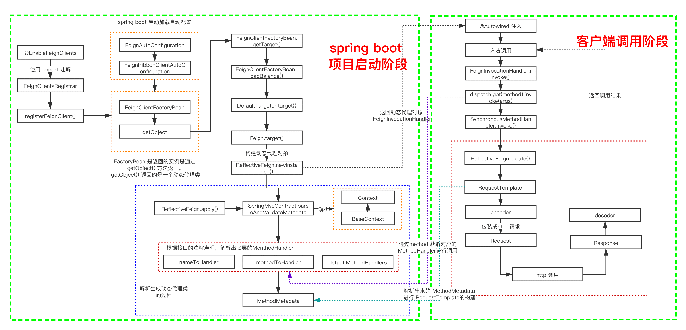

# open feign

前面一章对 [spring cloud ribbon](springcloud/ribbon.md) 进行简单 demo 使用，对 RestTemplate 进行拦截实现负载均衡，但是还是会有一个问题，随着服务的变多，url 地址的维护变得困难。从而引出了 open feign 组件。

open geign 是一个伪 RPC 组件，它封装了Http调用流程，更适合面向接口化的变成习惯。

# 使用 demo

基于 [spring cloud ribbon](springcloud/ribbon.md) 中的 demo 基础上，新增以下内容

```xml
<dependency>
    <groupId>org.springframework.cloud</groupId>
    <artifactId>spring-cloud-starter-openfeign</artifactId>
    <version>2.2.3.RELEASE</version>
</dependency>

<!--可以支持OKHTTP-->
<!--<dependency>
    <groupId>io.github.openfeign</groupId>
    <artifactId>feign-okhttp</artifactId>
</dependency>-->
```

代理类

```java
@FeignClient("order-service")
public interface UserServiceFeignClient {
    @GetMapping("orders")
    String orders();
}
```

可以使用 RPC 模式调用

```java
@RestController
public class UserController {

    @Autowired
    private UserServiceFeignClient userServiceFeignClient;
    
    @GetMapping("user")
    public String user() {
        return userServiceFeignClient.orders();
    }
}
```

Spring boot 中启动类

```java
@SpringBootApplication
@EnableFeignClients(basePackages = "com.example.user.service")
public class Application {
    public static void main(String[] args) {
        SpringApplication.run(Application.class, args);
    }
}
```


# 源码分析

从 ribbon 中的 demo 与上面集成了open feign 的例子对比，我们不需要在去频繁的维护接口地址信息了，只需要面向接口编程就可以了。

那么 openfeign 帮我们做了哪些事情呢？

- 配置项的解析和装载
- 针对 FeignClient 中的方法描述进行解析并动态代理对象
- 组装出一个 Request 对象，发起 http 请求


源码总体流程图




## FeignClient 初始化过程

那么源码分析就先要找到入口，我们从 demo 中只用了 `@EnableFeignClients` 启动就可以启动了，那么分析这个注解做了哪些功能。

### @EnableFeignClients

```java
@Retention(RetentionPolicy.RUNTIME)
@Target(ElementType.TYPE)
@Documented
@Import(FeignClientsRegistrar.class)
public @interface EnableFeignClients {
    // ....
}
```

这个使用了 `@Import` 注解，我们知道这个注解是用来导入一个配置类的，查看 FeignClientsRegistrar 的定义。

```java
class FeignClientsRegistrar implements ImportBeanDefinitionRegistrar, ResourceLoaderAware, EnvironmentAware {
	// ...
}
```

FeignClientsRegistrar 实现了 ImportBeanDefinitionRegistrar，它是一个动态注入 Bean 的接口，Spring Boot 启动的时候，会调用这个类中实现的 registerBeanDefinitions 方法来实现动态 Bean 的装载。

:tada::tada::tada::tada::tada::tada::tada::tada: 找到入口了，我们就可以愉快的分析源码了。

### registerBeanDefinitions.registerBeanDefinitions()

```java
public void registerBeanDefinitions(AnnotationMetadata metadata,
                                    BeanDefinitionRegistry registry) {
    // 扫描使用 Feign 框架的配置内容
    registerDefaultConfiguration(metadata, registry);
    // 扫描 FeignClients 注解类的内容
    registerFeignClients(metadata, registry);
}
```

这个方法里面使用了两个方法，从名字不难看出具体的工作内容

- registerDefaultConfiguration：主要是扫描使用框架的定义的默认、自定义配置信息，@EnableFeignClients 支持自定义配置内容。
- registerFeignClients：扫描 @FeignClient 注解内容

### registerBeanDefinitions.registerDefaultConfiguration()

```java
private void registerDefaultConfiguration(AnnotationMetadata metadata,
                                          BeanDefinitionRegistry registry) {
    Map<String, Object> defaultAttrs = metadata
        .getAnnotationAttributes(EnableFeignClients.class.getName(), true);

    if (defaultAttrs != null && defaultAttrs.containsKey("defaultConfiguration")) {
        String name;
        if (metadata.hasEnclosingClass()) {
            name = "default." + metadata.getEnclosingClassName();
        }
        else {
            name = "default." + metadata.getClassName();
        }
        registerClientConfiguration(registry, name, defaultAttrs.get("defaultConfiguration"));
    }
}
```

这个主要扫描默认的配置信息，并添加到 spring 容器中，与主流程关联不大，就不细致分析了。

### registerBeanDefinitions.registerFeignClients()

```java
public void registerFeignClients(AnnotationMetadata metadata,
                                 BeanDefinitionRegistry registry) {
    
    // 省略相关代码，主要工作是扫描 EnableFeignClients、FeignClient 配置相关内容
    
    // 循环 EnableFeignClients 中 basePackages，
    for (String basePackage : basePackages) {
        Set<BeanDefinition> candidateComponents = scanner
            .findCandidateComponents(basePackage);
        for (BeanDefinition candidateComponent : candidateComponents) {
            if (candidateComponent instanceof AnnotatedBeanDefinition) {
                // verify annotated class is an interface
                // 省略部分代码，主要是对接口的校验
                // 注册到 spring 容器中
                registerFeignClient(registry, annotationMetadata, attributes);
            }
        }
    }
}

private void registerFeignClient(BeanDefinitionRegistry registry,
                                 AnnotationMetadata annotationMetadata, Map<String, Object> attributes) {
    String className = annotationMetadata.getClassName();
    // 构建的 BeanDefinition 传入了一个 FeignClientFactoryBean 类
    // 这是一个 FactoryBean
    BeanDefinitionBuilder definition = BeanDefinitionBuilder
        .genericBeanDefinition(FeignClientFactoryBean.class);
    // 省略代码，主要工作是封装成一个 BeanDefinition
    BeanDefinitionHolder holder = new BeanDefinitionHolder(beanDefinition, className,
                                                           new String[] { alias });
    // 注册到 spring 容器中去
    BeanDefinitionReaderUtils.registerBeanDefinition(holder, registry);
}
```

> FeignClinet 实际上是利用 Spring 的代理工厂来生成代理类，所以在这里才会把所有的 FeignClient 的 BeanDefinition 设置成为 FeignClientFactoryBean 类型，而FeignClientFactoryBean 继承 FactoryBean。<br/>在 Spring 中，FactoryBean 是用来创建代理 Bean。<br/>工厂 Bean 是一种特殊的 Bean，对于 Bean 的消费者来说，它逻辑上是感知不到这个 Bean 是普通 Bean 还是 FactoryBean的，只是按照正常的获取 Bean 方式去调用，但是 FactoryBean 最后返回的实例不是 FactoryBean 本身，而是执行 FactoryBean.getObject() 逻辑返回的实例。

### FeignClientFactoryBean.getObject

```java
public Object getObject() throws Exception {
    return getTarget();
}

<T> T getTarget() {
    // 获取 Feign 的上下文信息，它是用来来统一维护feign中各个feign客户端相互隔离的上下文。
    // 在 FeignAutoConfiguration 完成 bean 注入
    FeignContext context = this.applicationContext.getBean(FeignContext.class);
    // 构造器，主要是构造了日志、序列化、反序列化、解析器
    Feign.Builder builder = feign(context);
	// 如果url 不为空，则走负载均衡功能的代理类
    // url = http://order-service
    if (!StringUtils.hasText(this.url)) {
        if (!this.name.startsWith("http")) {
            this.url = "http://" + this.name;
        }
        else {
            this.url = this.name;
        }
        this.url += cleanPath();
        // 返回具有负载均衡的代理类
        return (T) loadBalance(builder, context,
                               new HardCodedTarget<>(this.type, this.name, this.url));
    }
    //如果指定了url，则生成默认的代理类
    if (StringUtils.hasText(this.url) && !this.url.startsWith("http")) {
        this.url = "http://" + this.url;
    }
    String url = this.url + cleanPath();
    Client client = getOptional(context, Client.class);
    if (client != null) {
        if (client instanceof LoadBalancerFeignClient) {
            // not load balancing because we have a url,
            // but ribbon is on the classpath, so unwrap
            client = ((LoadBalancerFeignClient) client).getDelegate();
        }
        if (client instanceof FeignBlockingLoadBalancerClient) {
            // not load balancing because we have a url,
            // but Spring Cloud LoadBalancer is on the classpath, so unwrap
            client = ((FeignBlockingLoadBalancerClient) client).getDelegate();
        }
        builder.client(client);
    }
    // 获取动态代理生成的代理类
    Targeter targeter = get(context, Targeter.class);
    return (T) targeter.target(this, builder, context,
                               new HardCodedTarget<>(this.type, this.name, url));
}
```

### FeignClientFactoryBean.loadBalance()

```java
protected <T> T loadBalance(Feign.Builder builder, FeignContext context,
                            HardCodedTarget<T> target) {
    // 从上下文中获取一个客户端
    // 上下文在 FeignRibbonClientAutoConfiguration 中配置 默认是 LoadBalancerFeignClient
    Client client = getOptional(context, Client.class);
    if (client != null) {
        builder.client(client);
        // 获取FeignAutoConfiguration配置中的
        // 默认提供的 DefaultTargeter
        Targeter targeter = get(context, Targeter.class);
        // 获取动态代理生成的代理类
        return targeter.target(this, builder, context, target);
    }

    throw new IllegalStateException(
        "No Feign Client for loadBalancing defined. Did you forget to include spring-cloud-starter-netflix-ribbon?");
}
```

#### FeignRibbonClientAutoConfiguration

```java
@Import({ HttpClientFeignLoadBalancedConfiguration.class,
		OkHttpFeignLoadBalancedConfiguration.class,
		DefaultFeignLoadBalancedConfiguration.class })
public class FeignRibbonClientAutoConfiguration {
	// 省略代码...
}
```

#### DefaultFeignLoadBalancedConfiguration

```java
@Configuration(proxyBeanMethods = false)
class DefaultFeignLoadBalancedConfiguration {
	@Bean
	@ConditionalOnMissingBean
	public Client feignClient(CachingSpringLoadBalancerFactory cachingFactory,
			SpringClientFactory clientFactory) {
		return new LoadBalancerFeignClient(new Client.Default(null, null), cachingFactory,
				clientFactory);
	}
}
```

#### FeignAutoConfiguration

```java
public class FeignAutoConfiguration {

    // 省略代码
    
	@Configuration(proxyBeanMethods = false)
	@ConditionalOnMissingClass("feign.hystrix.HystrixFeign")
	protected static class DefaultFeignTargeterConfiguration {
		@Bean
		@ConditionalOnMissingBean
		public Targeter feignTargeter() {
			return new DefaultTargeter();
		}
	}
}
```

### DefaultTargeter.target()

```java
class DefaultTargeter implements Targeter {
	@Override
	public <T> T target(FeignClientFactoryBean factory, Feign.Builder feign,
			FeignContext context, Target.HardCodedTarget<T> target) {
		return feign.target(target);
	}
}
```

### Feign.target()

```java
public <T> T target(Target<T> target) {
    // 构建 ReflectiveFeign 并 创建实例
    return build().newInstance(target);
}

public Feign build() {
    // 省略相关代码...
    // 主要是解析各种配置内容
    // 返回 ReflectiveFeign 实例
    return new ReflectiveFeign(handlersByName, invocationHandlerFactory, queryMapEncoder);
}
```

### ReflectiveFeign.newInstance()

```java
public <T> T newInstance(Target<T> target) {
    // 根据接口类和Contract协议解析方式，解析接口类上的方法和注解，
    // 转换成内部的 MethodHandler 处理方式
    Map<String, MethodHandler> nameToHandler = targetToHandlersByName.apply(target);
    Map<Method, MethodHandler> methodToHandler = new LinkedHashMap<Method, MethodHandler>();
    List<DefaultMethodHandler> defaultMethodHandlers = new LinkedList<DefaultMethodHandler>();

    for (Method method : target.type().getMethods()) {
        if (method.getDeclaringClass() == Object.class) {
            continue;
        } else if (Util.isDefault(method)) {
            DefaultMethodHandler handler = new DefaultMethodHandler(method);
            defaultMethodHandlers.add(handler);
            methodToHandler.put(method, handler);
        } else {
            methodToHandler.put(method, nameToHandler.get(Feign.configKey(target.type(), method)));
        }
    }
    // 创建一个 FeignInvocationHandler 代理
    InvocationHandler handler = factory.create(target, methodToHandler);
    // 哈哈哈
    // 基于 jdk 的动态代理生成代理类
    T proxy = (T) Proxy.newProxyInstance(target.type().getClassLoader(),
                                         new Class<?>[] {target.type()}, handler);

    for (DefaultMethodHandler defaultMethodHandler : defaultMethodHandlers) {
        defaultMethodHandler.bindTo(proxy);
    }
    return proxy;
}
```

### TargetToHandlersByName.apply()

```java
public Map<String, MethodHandler> apply(Target target) {
    List<MethodMetadata> metadata = contract.parseAndValidateMetadata(target.type());
    Map<String, MethodHandler> result = new LinkedHashMap<String, MethodHandler>();
    for (MethodMetadata md : metadata) {
        BuildTemplateByResolvingArgs buildTemplate;
        if (!md.formParams().isEmpty() && md.template().bodyTemplate() == null) {
            buildTemplate =
                new BuildFormEncodedTemplateFromArgs(md, encoder, queryMapEncoder, target);
        } else if (md.bodyIndex() != null) {
            buildTemplate = new BuildEncodedTemplateFromArgs(md, encoder, queryMapEncoder, target);
        } else {
            buildTemplate = new BuildTemplateByResolvingArgs(md, queryMapEncoder, target);
        }
        if (md.isIgnored()) {
            result.put(md.configKey(), args -> {
                throw new IllegalStateException(md.configKey() + " is not a method handled by feign");
            });
        } else {
            result.put(md.configKey(),
                       factory.create(target, md, buildTemplate, options, decoder, errorDecoder));
        }
    }
    return result;
}
```

这个方法会解析接口方法上的注解，从而解析出方法粒度的特定的配置信息，然后生产一个 SynchronousMethodHandler 然后需要维护一个<method，MethodHandler> 的 map，放入 InvocationHandler 的实现 FeignInvocationHandler 中。

至此，spring boot 启动后 OpenFeign 的准备工作完成了，接下来，我们在实际代码中去注入使用。


## FeignClient 调用过程

```java
@Autowired
private UserServiceFeignClient userServiceFeignClient;
```

我们知道 Spring 返回的是一个 FeignInvocationHandler 对象，那么客户端发起调用的时候，就会进入到这个对象的 invoke() 方法中。

### FeignInvocationHandler.invoke()

```java
public Object invoke(Object proxy, Method method, Object[] args) throws Throwable {
    // 排除 Object 方法
    if ("equals".equals(method.getName())) {
        try {
            Object otherHandler =
                args.length > 0 && args[0] != null ? Proxy.getInvocationHandler(args[0]) : null;
            return equals(otherHandler);
        } catch (IllegalArgumentException e) {
            return false;
        }
    } else if ("hashCode".equals(method.getName())) {
        return hashCode();
    } else if ("toString".equals(method.getName())) {
        return toString();
    }
	// 上面分析 dispatch = SynchronousMethodHandler
    return dispatch.get(method).invoke(args);
}
```

### SynchronousMethodHandler.invoke()

```java
public Object invoke(Object[] argv) throws Throwable {
    // 根据参数生成 RequestTemplate
    RequestTemplate template = buildTemplateFromArgs.create(argv);
    Options options = findOptions(argv);
    Retryer retryer = this.retryer.clone();
    while (true) {
        try {
            // 动态生成Request
            return executeAndDecode(template, options);
        } catch (RetryableException e) {
            try {
                retryer.continueOrPropagate(e);
            } catch (RetryableException th) {
                Throwable cause = th.getCause();
                if (propagationPolicy == UNWRAP && cause != null) {
                    throw cause;
                } else {
                    throw th;
                }
            }
            if (logLevel != Logger.Level.NONE) {
                logger.logRetry(metadata.configKey(), logLevel);
            }
            continue;
        }
    }
}
```

### SynchronousMethodHandler.executeAndDecode()

```java
Object executeAndDecode(RequestTemplate template, Options options) throws Throwable {
    // 转化成 http 请求报文
    Request request = targetRequest(template);

    if (logLevel != Logger.Level.NONE) {
        logger.logRequest(metadata.configKey(), logLevel, request);
    }

    Response response;
    long start = System.nanoTime();
    try {
        // 发起远程通信
        // 根据一系列的方法调用，最后使用的是 jdk HttpURLConnection 客户端
        // client = LoadBalancerFeignClient
        response = client.execute(request, options);
        // 获取返回结果
        response = response.toBuilder()
            .request(request)
            .requestTemplate(template)
            .build();
    } catch (IOException e) {
        if (logLevel != Logger.Level.NONE) {
            logger.logIOException(metadata.configKey(), logLevel, e, elapsedTime(start));
        }
        throw errorExecuting(request, e);
    }
    long elapsedTime = TimeUnit.NANOSECONDS.toMillis(System.nanoTime() - start);


    if (decoder != null)
        return decoder.decode(response, metadata.returnType());

    CompletableFuture<Object> resultFuture = new CompletableFuture<>();
    asyncResponseHandler.handleResponse(resultFuture, metadata.configKey(), response,
                                        metadata.returnType(),
                                        elapsedTime);

    try {
        if (!resultFuture.isDone())
            throw new IllegalStateException("Response handling not done");

        return resultFuture.join();
    } catch (CompletionException e) {
        Throwable cause = e.getCause();
        if (cause != null)
            throw cause;
        throw e;
    }
}
```

### LoadBalancerFeignClient.execute()

```java
public Response execute(Request request, Request.Options options) throws IOException {
    try {
        URI asUri = URI.create(request.url());
        String clientName = asUri.getHost();
        URI uriWithoutHost = cleanUrl(request.url(), clientName);
        FeignLoadBalancer.RibbonRequest ribbonRequest = new FeignLoadBalancer.RibbonRequest(
            this.delegate, request, uriWithoutHost);

        IClientConfig requestConfig = getClientConfig(options, clientName);
        // lbClient(clientName) = FeignLoadBalancer
        // FeignLoadBalancer 没有实现，调用父类AbstractLoadBalancerAwareClient实现
        return lbClient(clientName)
            .executeWithLoadBalancer(ribbonRequest, requestConfig).toResponse();
    }
    catch (ClientException e) {
        IOException io = findIOException(e);
        if (io != null) {
            throw io;
        }
        throw new RuntimeException(e);
    }
}
```

### AbstractLoadBalancerAwareClient.executeWithLoadBalancer()

```java
public T executeWithLoadBalancer(final S request, final IClientConfig requestConfig) throws ClientException {
    LoadBalancerCommand<T> command = buildLoadBalancerCommand(request, requestConfig);

    try {
        return command.submit(
            new ServerOperation<T>() {
                @Override
                public Observable<T> call(Server server) {
                    URI finalUri = reconstructURIWithServer(server, request.getUri());
                    S requestForServer = (S) request.replaceUri(finalUri);
                    try {
                        // AbstractLoadBalancerAwareClient.this = FeignLoadBalancer
                        return Observable.just(AbstractLoadBalancerAwareClient.this.execute(requestForServer, requestConfig));
                    } 
                    catch (Exception e) {
                        return Observable.error(e);
                    }
                }
            })
            .toBlocking()
            .single();
    } catch (Exception e) {
        Throwable t = e.getCause();
        if (t instanceof ClientException) {
            throw (ClientException) t;
        } else {
            throw new ClientException(e);
        }
    }

}
```

### FeignLoadBalancer.execute()

```java
public RibbonResponse execute(RibbonRequest request, IClientConfig configOverride)
    throws IOException {
    Request.Options options;
    if (configOverride != null) {
        RibbonProperties override = RibbonProperties.from(configOverride);
        options = new Request.Options(override.connectTimeout(this.connectTimeout),
                                      override.readTimeout(this.readTimeout));
    }
    else {
        options = new Request.Options(this.connectTimeout, this.readTimeout);
    }
    // request.client() =  Client
    Response response = request.client().execute(request.toRequest(), options);
    return new RibbonResponse(request.getUri(), response);
}
```

### Client.execute()

```java
public Response execute(Request request, Options options) throws IOException {
    // jdk HttpURLConnection 底层调用逻辑
    HttpURLConnection connection = convertAndSend(request, options);
    return convertResponse(connection, request);
}
```


## 总结

OpenFeign 其作用是简化接口的调用，将 http 调用转为 rpc 调用，让调用远程接口像同进程应用内的接口调用一样简单。与 dubbo 的 rpc 远程调用一样，通过动态代理实现接口的调用。feign 通过封装包装请求体、发送 http 请求、获取接口响应结果、序列化响应结果等接口调用动作来简化接口的调用。

:tada::tada::tada::tada::tada::tada::tada::tada::tada:

