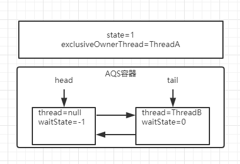
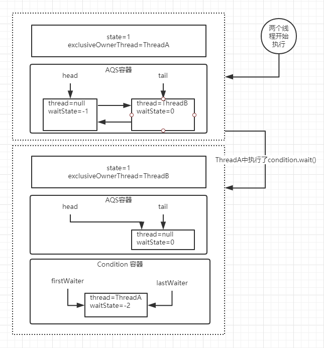
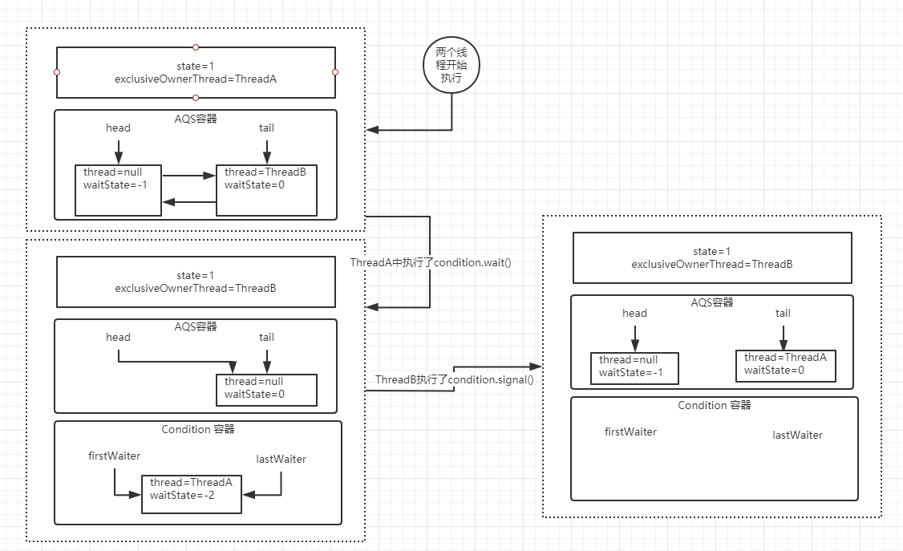
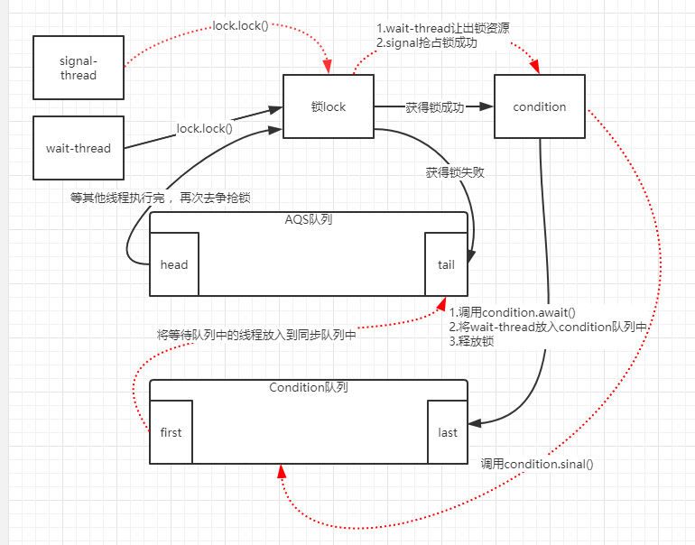

# Condition 

## 基本使用

Condition 是一个多线程协调通信的工具类，可以让某些线程一起等待某个条件，只有满足条件时，线程才会被唤醒（等同于synchronized 中的wait/notify）

**ConditionWait** 

```java
public class ConditionWait extends Thread{
    private Lock lock;
    private Condition condition;
    public ConditionWait(Lock lock, Condition condition) {
        this.lock = lock;
        this.condition = condition;
    }
    @Override
    public void run() {
        try {
            lock.lock();
            System.out.println("ConditionWait  start");
            condition.await();
            System.out.println("ConditionWait  end");
        } catch (InterruptedException e) {
            e.printStackTrace();
        } finally {
            lock.unlock();
        }
    }
}
```


**ConditionSignal** 

```java
public class ConditionSignal extends Thread{
    private Lock lock;
    private Condition condition;
    public ConditionSignal(Lock lock, Condition condition) {
        this.lock = lock;
        this.condition = condition;
    }
    @Override
    public void run() {
        try {
            lock.lock();
            System.out.println("ConditionSignal  start");
            condition.signal();
            System.out.println("ConditionSignal  end");
        } catch (Exception e) {
            e.printStackTrace();
        } finally {
            lock.unlock();
        }
    }
}
```

**ConditionDemo** 

```java
public class ConditionDemo {
    static Lock lock = new ReentrantLock();
    static Condition condition = lock.newCondition();
    public static void main(String[] args) {
        new ConditionWait(lock, condition).start();
        new ConditionSignal(lock, condition).start();
    }
}
```


## 源码分析

AQS 是基于 FIFO 双向链表实现，Condition 是基于单链实现。

首先使用 Condition，需要或得 lock 锁，所以意味着会存在一个 AQS 同步队列。

设想一下，假如有两个线程同时运行，那么AQS队列可能会是下面的情况

重入锁下：

state 表示同步状态，0：无锁，>1：有锁

waitState: 表示当前node节点等待状态。




然后根据两个线程代码执行，threadA 调用了 `Condition.wait()` 会是当前线程（上图ThreadA）进入Condition队列并释放锁，AQS队列中下一节点去争抢锁（上图ThreadB）。当前线程会挂起等待被唤醒。



### Condition.await()

```java
public final void await() throws InterruptedException {
    if (Thread.interrupted())// 表示await允许被中断
        throw new InterruptedException();
    // 采用链表格式创建一个condition状态的节点
    Node node = addConditionWaiter();
    // 释放当前线程的锁，得到锁的状态，并唤醒AQS队列中的一个线程
    int savedState = fullyRelease(node);
    int interruptMode = 0;
    // 如果当前节点没有在同步队列上，即还没有被唤醒，则将当前线程阻塞
    while (!isOnSyncQueue(node)) {// 判断这个节点是否在AQS队列中，第一次判断为false，因为上面代码已经释放锁了
        LockSupport.park(this);// park 挂起线程
        if ((interruptMode = checkInterruptWhileWaiting(node)) != 0)
            break;
    }
    // 当这个线程被唤醒，会尝试争抢锁,acquireQueued()返回false表示拿到锁
    // interruptMode != THROW_IE 表示这个线程没有成功入队，但singal执行enq()让其入队了
    // 将这个变量设置成REINTERRUPT
    if (acquireQueued(node, savedState) && interruptMode != THROW_IE)
        interruptMode = REINTERRUPT;
    // 如果node下一节点是null，就不需要清理Cancelled状态的节点
    if (node.nextWaiter != null) // clean up if cancelled
        unlinkCancelledWaiters();
    // 如果线程被中断了,需要抛出异常.或者什么都不做
    if (interruptMode != 0)
        reportInterruptAfterWait(interruptMode);
}
```


#### AQS.addConditionWaiter()

```java
// 这里的链表是Condition同步队列，是单向链表
private Node addConditionWaiter() {
    Node t = lastWaiter;
    //如果lastWaiter不等于空并且waitStatus不等于CONDITION时，把冲好这个节点从链表中移除
    if (t != null && t.waitStatus != Node.CONDITION) {
        unlinkCancelledWaiters();
        t = lastWaiter;
    }
    // 构建一个Node节点
    Node node = new Node(Thread.currentThread(), Node.CONDITION);
    if (t == null)
        firstWaiter = node;
    else
        t.nextWaiter = node;
    lastWaiter = node;
    return node;
}
```


#### AQS.fullyRelease()

```java
final int fullyRelease(Node node) {
    boolean failed = true;
    try {
        // 获得重入次数
        int savedState = getState();
        if (release(savedState)) {//释放并唤醒下一个同步队列中断的线程
            failed = false;
            return savedState;
        } else {
            throw new IllegalMonitorStateException();
        }
    } finally {
        if (failed)
            node.waitStatus = Node.CANCELLED;
    }
}
```

fullRelease，就是彻底的释放锁，什么叫彻底呢，就是如果 当前锁存在多次重入，那么在这个方法中只需要释放一次就会把所有的重入次数归零。


#### AQS.isOnSyncQueue()

```java
final boolean isOnSyncQueue(Node node) {
    if (node.waitStatus == Node.CONDITION || node.prev == null)
        return false;
    if (node.next != null) // If has successor, it must be on queue
        return true;

    return findNodeFromTail(node);
}
```

判断当前线程是否在同步队列中，false表示不存在。

如果不存在AQS队列中，说明当前节点没有唤醒去争抢同步锁，所以需要把当前线程阻塞起来，直到其它的线程调用signal、signalAll 唤醒

如果存在AQS队列中，意味着它需要去竞争同步锁去获得执行程序执行权限


### Condition.signal()

`Condition.await()`方法会阻塞 ThreadA，然后 ThreadB 抢占到了锁获得了执行权限，这个时候在 ThreadB 中调用了`Condition.signal()`方法，将会唤醒在等待队列中节点





```java
public final void signal() {
    //先判断当前线程是否获得了锁，这个判断比较简单，
    //直接用获得锁的线程和当前线程相比即可
    if (!isHeldExclusively())
        throw new IllegalMonitorStateException();
    // 拿到 Condition队列上第一个节点
    Node first = firstWaiter;
    if (first != null)
        doSignal(first);
}
```


#### Condition.doSignal()

```java
private void doSignal(Node first) {
    do {
        // 从Condition队列中删除firstWaiter
        if ( (firstWaiter = first.nextWaiter) == null)
            lastWaiter = null;
        first.nextWaiter = null;
    } while (!transferForSignal(first) &&
             (first = firstWaiter) != null);
}
```


##### AQS.transferForSignal()

```java
final boolean transferForSignal(Node node) {
    //更新节点的状态为 0，如果更新失败，只有一种可能就是节点被 CANCELLED 了
    if (!compareAndSetWaitStatus(node, Node.CONDITION, 0))
        return false;
	//调用 enq，把当前节点添加到AQS 队列。
    //并且返回返回按当前节点的上一个节点，也就是原tail 节点
    Node p = enq(node);
    int ws = p.waitStatus;
    // 如果上一个节点的状态被取消了, 或者尝试设置上一个节点的状态为SIGNAL失败
    // SIGNAL表示: 他的next节点需要停止阻塞
    if (ws > 0 || !compareAndSetWaitStatus(p, ws, Node.SIGNAL))
        // 唤醒节点上的线程
        LockSupport.unpark(node.thread);
    return true;
}
```


该方法先是 CAS 修改了节点状态，如果成功，就将这个节点放到 AQS 队列中，然后唤醒这个节点上的线程。此时，那个节点就会在 await 方法中苏醒

## Condition 整个执行逻辑图解



